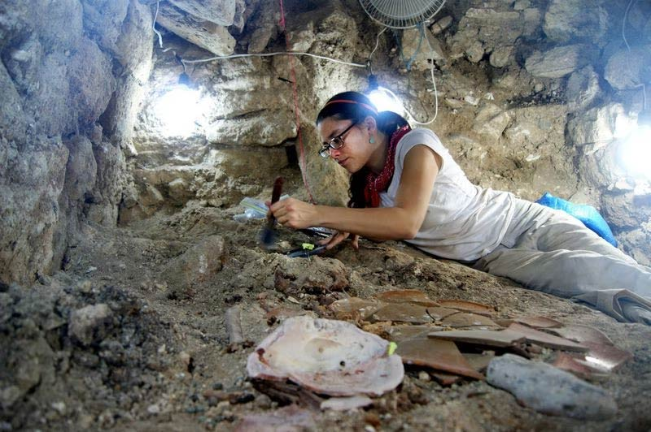
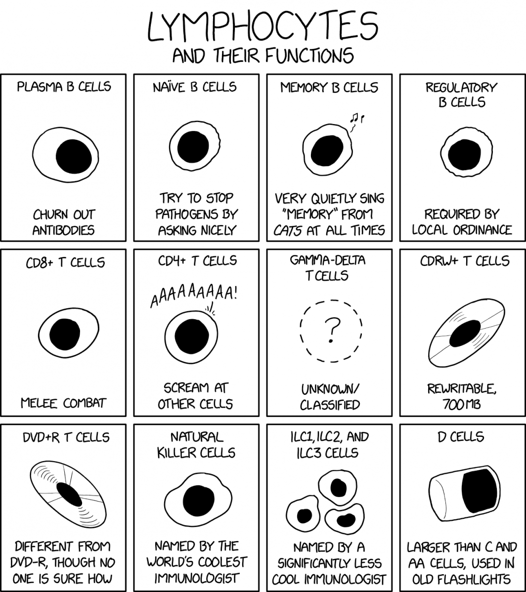
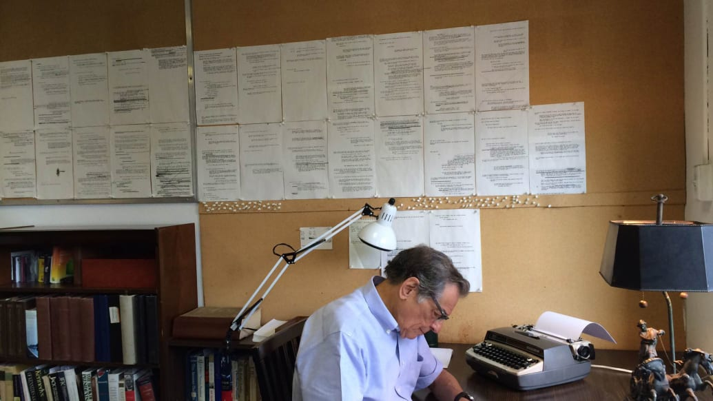
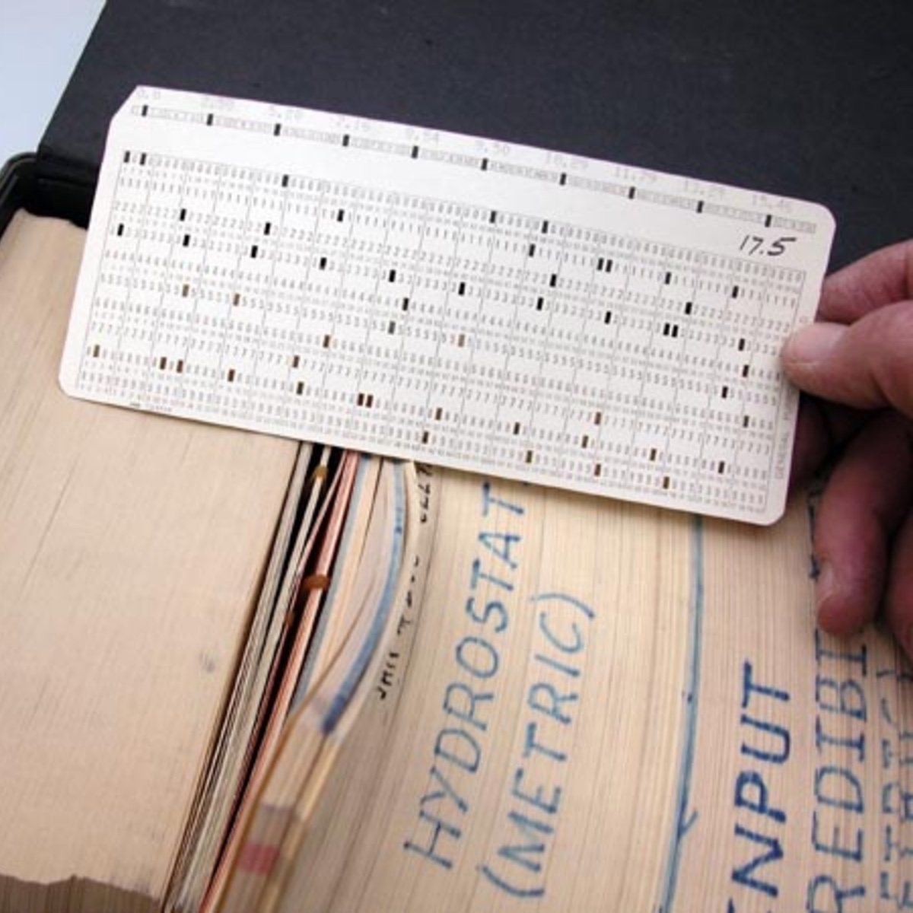
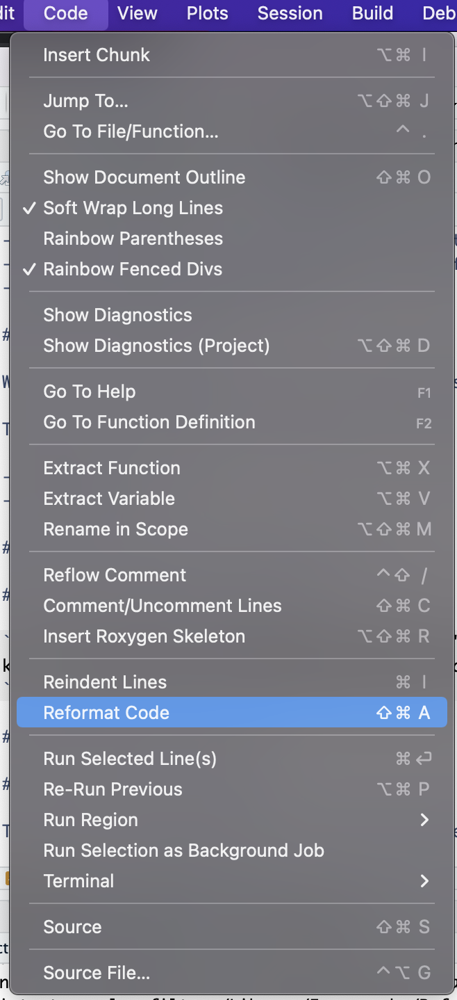
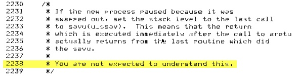

```{r setup, include=FALSE}
knitr::opts_chunk$set(echo = FALSE, message = FALSE, warning = FALSE)
```

## Separating writing and editing

```{r out.width = "0.9\\textwidth", fig.align = "center", echo = FALSE}
knitr::include_graphics("figures/writing_editing.png")
```

## Write your code fast...

```{r out.width = "0.9\\textwidth", fig.align = "center", echo = FALSE}

```

## ... but edit it slowly.

```{r out.width = "0.9\\textwidth", fig.align = "center", echo = FALSE}

```

## Editing code

The aims of editing code are to make it **easier to understand**, which will 
help make it **easier to maintain**.

```{r out.width = "0.8\\textwidth", fig.align = "center", echo = FALSE}

```

## Editing code

```{r out.width = "0.8\\textwidth", fig.align = "center", echo = FALSE}
knitr::include_graphics("figures/code_lifespan.png")
```

xkcd Explained: https://www.explainxkcd.com/wiki/index.php/File:code_lifespan_2x.png

## Editing code

In this lecture, we'll cover several steps you can take to edit your code. 
These include: 

- Change names to be good names
- Break up monolithic code
- Remove dead-end code 
- Add useful comments

After the lecture, we'll have a lab, where you'll try applying some of these
ideas in an example code script. 

## Use good names

```{r out.width = "0.7\\textwidth", fig.align = "center", echo = FALSE}

```

## Use good names

```{r out.width = "\\textwidth", echo = FALSE}

```

## Use good names

If you use good names, it makes your code self-documenting---in other words, the
name by itself gives the reader information about what the code is doing.

Edit your code to have good names for, among others: 

- objects (e.g., dataframes, vectors)
- columns in dataframes
- functions
- files

The [tidyverse style guide](https://style.tidyverse.org/index.html) includes
advice for naming things in R. 

## Good names for objects

One common edit will be changing the names of objects from 
**metasyntactic variables** to better variable names.

**Metasyntactic variables** are a fancy name for placeholder variable names.
Common examples include:

- foo, bar, baz (C, C#)
- spam, ham, eggs (Python)
- toto, tata, titi, tutu (French)
- pippo, pluto, paperino (Italian)

They're often used by coders when they're editing fast. That's fine, but be sure
to edit them out in favor of better names.

## Good names for objects

Here are some suggestions drawn from the [tidyverse style guide for syntax](https://style.tidyverse.org/syntax.html). Consider selecting 
object names that:

- Convey what's in the object (e.g., `animal_calls` versus `foo`)
- Use only lowercase (e.g., `animal_calls` versus `Animal_calls`)
- Use underscores to make words in object name easier to read (e.g., `animal_calls`
rather than `animalcalls`)
- not too short, not too long (although tab completion can help)
- Use nouns for objects that are data containers

## Good names for columns

- Consider all the guidelines from naming objects
- There is one exception---it's fine to have the same column name in columns
of different dataframes (whereas you can only one object with a given name per 
R environment)
- Avoid spaces in column names. You can force them to work, but it's a pain.

```{r eval = FALSE, echo = TRUE}
my_data %>% 
  mutate(`A column with a long, Tricky name` = 
           factor(`A column with a long, Tricky name`), 
         better_name = as.numeric(better_name))
```

## Fixing column names

Often, you'll have problems with column names when you read data in from an Excel
file or other spreadsheet-based file. 

There's an R package that can automate some basic improvements to the column
names. The `janitor` package has a function called `clean_names` that:

- Converts to lowercase
- Replaces spaces with underscores
- Removes special characters (anything expect letters, numbers, and underscores) 


## Fixing column names

Here's an example of a simple dataframw with bad column names:

```{r}
library(tibble)
df <- tibble(`Column with Long name` = 1:3, 
             `Shorter Name!` = c("a", "b", "c"))
df
```

## Fixing column names

You can make a lot of improvements to the column names using `clean_names` from the
`janitor` package:

```{r clean_column_names}
library(janitor)
df <- clean_names(df)
df
```

## Fixing column names

You can finish with customized changes with `rename` from `dplyr`:

```{r}
library(dplyr)
df <- df %>% 
  rename(longer_name = column_with_long_name)
df
```


## Break up monolithic code

One big aim of editing is to break up monolithic code to divide it 
into separate blocks and clarify what each block does.

Code that is easier to maintain and understand will often have 
more white space and clearer structure. 

[Cartoon view---code with structure versus code all in one piece]

## Break up monolithic code

[Image---monolith to stacked boxes to separated boxes]

## Break up monolithic code

- Identify sections of code that go together to solve a discrete 
part of your overall task
- Move calls to be near others doing the same subtask. For example, 
move all library calls (and function definitions) to the top of the code script
- Separate these sections using white space between sections ("Returns
are free" in R!)
- Used code comments to document each section

## Break up monolithic code

> "I can‘t start writing until I‘ve thought it through and can see it whole in my mind." 
---Robert Caro

```{r out.width = "\\textwidth", fig.align = "center", echo = FALSE}

```

## Break up monolithic code

Don't be afraid to split calls across lines. 

In general, you should try to 
keep each line of your code to 80 characters or fewer. 

```{r out.width = "0.6\\textwidth", fig.align = "center", echo = FALSE}

```

## Break up monolithic code

RStudio has a tool that can help with character lines and indenting: 

```{r out.width = "0.3\\textwidth", fig.align = "center", echo = FALSE}

```

## Break up monolithic code

There are also some packages that help to identify and fix some of these 
formatting issues, as well as complying with a style guide. 

One example is the `lintr` package: 

https://lintr.r-lib.org/


## Breaking up monolithic code

In RMarkdown files, separate code into more code chunks. 

You may find it helpful to name these chunks (so you can find and fix bugs). 

````{verbatim echo = TRUE}
```{r clean_column_names}
library(janitor)
df <- clean_names(df)
df
```
````

## Add useful comments

```{r out.width = "\\textwidth", fig.align = "center", echo = FALSE}

```

## Add useful comments

Don't go overboard with your comments. If the code is self-documenting (clear
on it's own by using good function names and object names), don't repeat with 
a comment. 

For example, you don't need the comment here: 

```{r echo = TRUE, eval = FALSE}
# Rename column `old_name` to `new_name`
df <- df %>% 
  rename(new_name = old_name)
```


## Edit out dead-ends

Writing code fast results in lots of dead ends.

There are a few types of "dead-ends" in code. They include: 

- "Interactive" code
- "Darlings"

## Types of dead-ends: Interactive code

## Types of dead-ends: Darlings

```{r out.width = "\\textwidth", fig.align = "center", echo = FALSE}

```

# Introduction to the labs

## Introduction to the labs

The rest of the workshop will alternate between lectures and labs. 
