```{r setup, include=FALSE}
knitr::opts_chunk$set(echo = FALSE, message = FALSE, warning = FALSE)
```

# Advantages of writing functions

## Do Not Repeat Yourself

Often, you'll want to do the same thing several times. For example, you might have
data files from different locations or experiments, and you want to perform the 
same analysis with all of them. 

## Do Not Repeat Yourself

In this scenario, your first draft of code might include a lot of repeated code, 
places where you've cut-and-pasted, like: 

```{r out.width = "0.7\\textwidth", fig.align = "center", echo = FALSE}
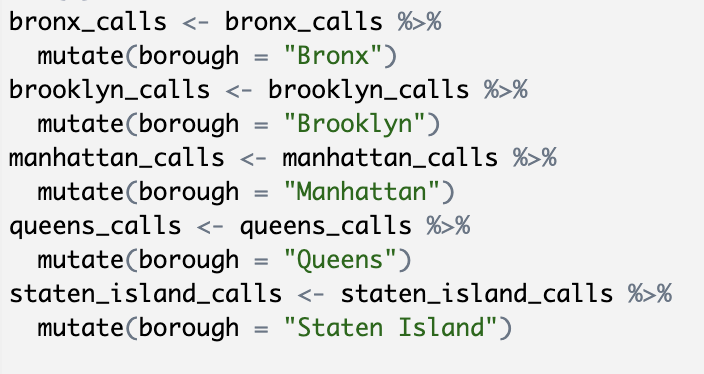
```

## Do Not Repeat Yourself

There are several limitations to code that repeats in this way, including: 

- As you evolve the code to do something lengthy or complex, you waste a lot of
time with copying-and-pasting
- If you want to change some of your code, you'll have to change it everywhere you 
copied-and-pasted it
- The code becomes very long, so it takes longer to read and understand it
- There is a limit to how far your code can scale (copy and paste 10 vs. 1,000 times)

Writing and using functions is one way to limit the amount of code you copy-and-paste.

## Encapsulating an idea with a function

Another advantage of a function is that it separates the code that performs a 
subtask from the application of that subtask. 

In practice, this lets you encapsulate the "idea" and implementation that you
need to perform a subtask, and then you can think more abstractly about that
subtask within the code script you develop for your data.

## Encapsulating an idea with a function

You can think of the lines in a code script as a series of gears that work together
to generate the final product, with the output of one feeding into the input of the
next.

```{r out.width = "\\textwidth", echo = FALSE}
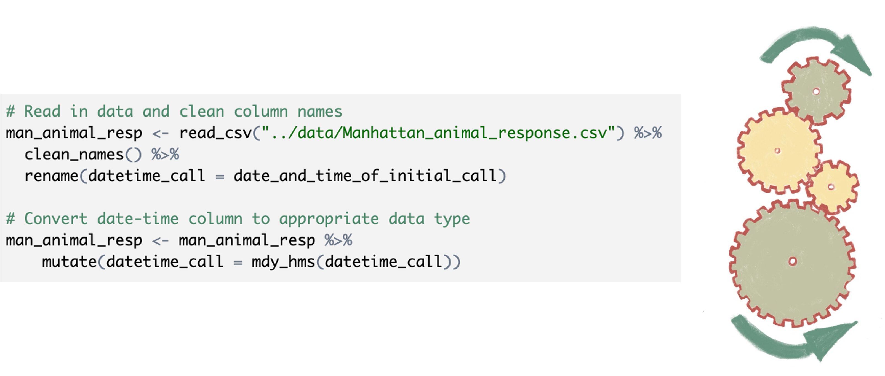
```

## Encapsulating an idea with a function

When you write a function, it's as if you enclose a series of these gears in 
a box. The gears at the start and end of the series will be exposed to the rest
of the code, but the gears in between will be enclosed in the box. 

```{r out.width = "\\textwidth", echo = FALSE}
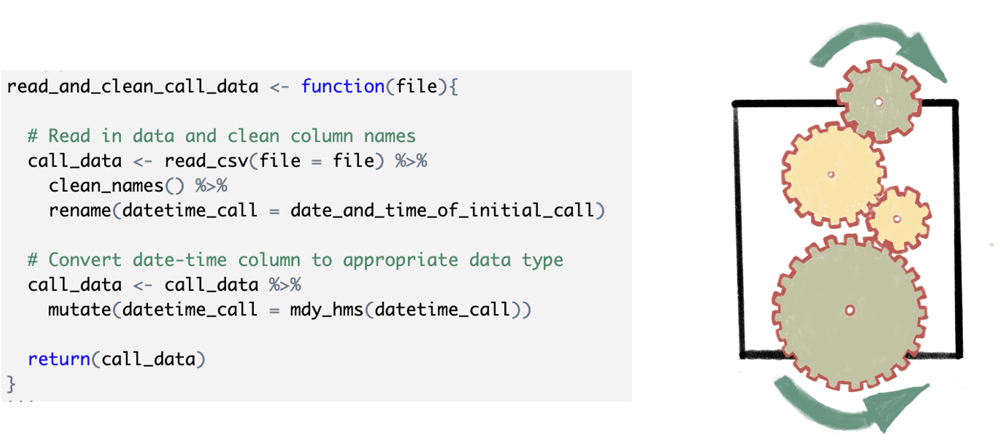
```

## Encapsulating an idea with a function

Once you've enclosed the interior gears, you can think about the function in 
terms of the task it does. When you apply the function, you can focus on this more
abstract idea, while you can work with the details of the code when you edit the 
code that defines the function.

```{r out.width = "\\textwidth", echo = FALSE}
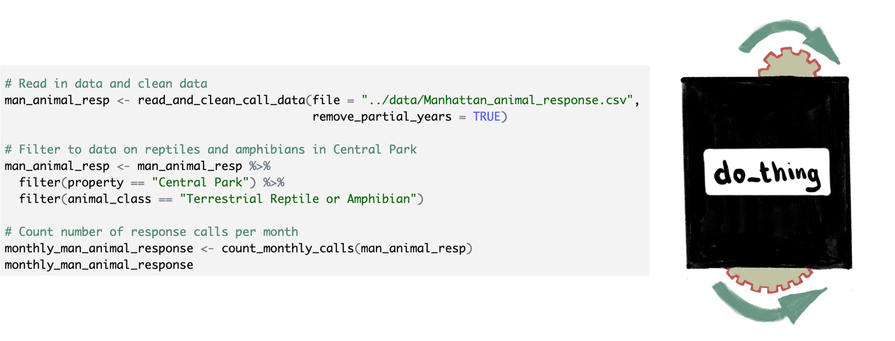
```

## Encapsulating an idea with a function

```{r out.width = "\\textwidth", echo = FALSE}
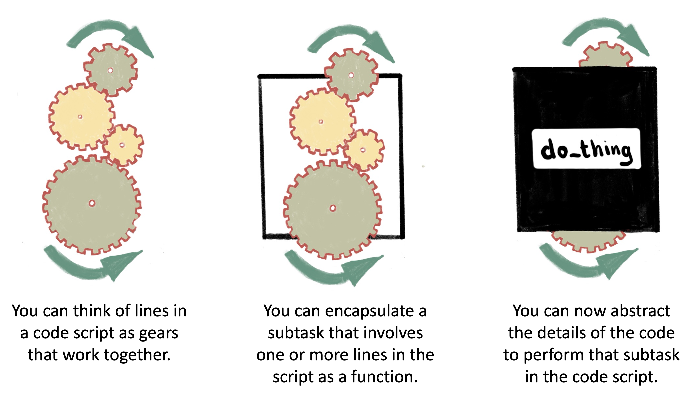
```

## Encapsulating an idea with a function

Encapsulation and abstraction are excellent tools for solving a complex problem
by: 

- breaking the problem into smaller steps
- tackling each of those small steps with attention to detail
- then combining the solutions for the small steps in a way that focuses on the big picture of the overall task

## Advantages of writing functions

There are also some other advantages of writing functions: 

- More efficient across broader work, since functions can be reused
- Each function can be documented clearly and thoroughly
- Writing functions is a step on the path toward writing packages and facilitates 
reproducibility within a team or larger community 
- Gets you in the habit of breaking up a complex coding task into discrete, 
do-able steps

# Writing functions

## Anatomy of a function

There are two key elements in the anatomy of a function: the API and the innards.

```{r out.width = "0.7\\textwidth", fig.align = "center", echo = FALSE}
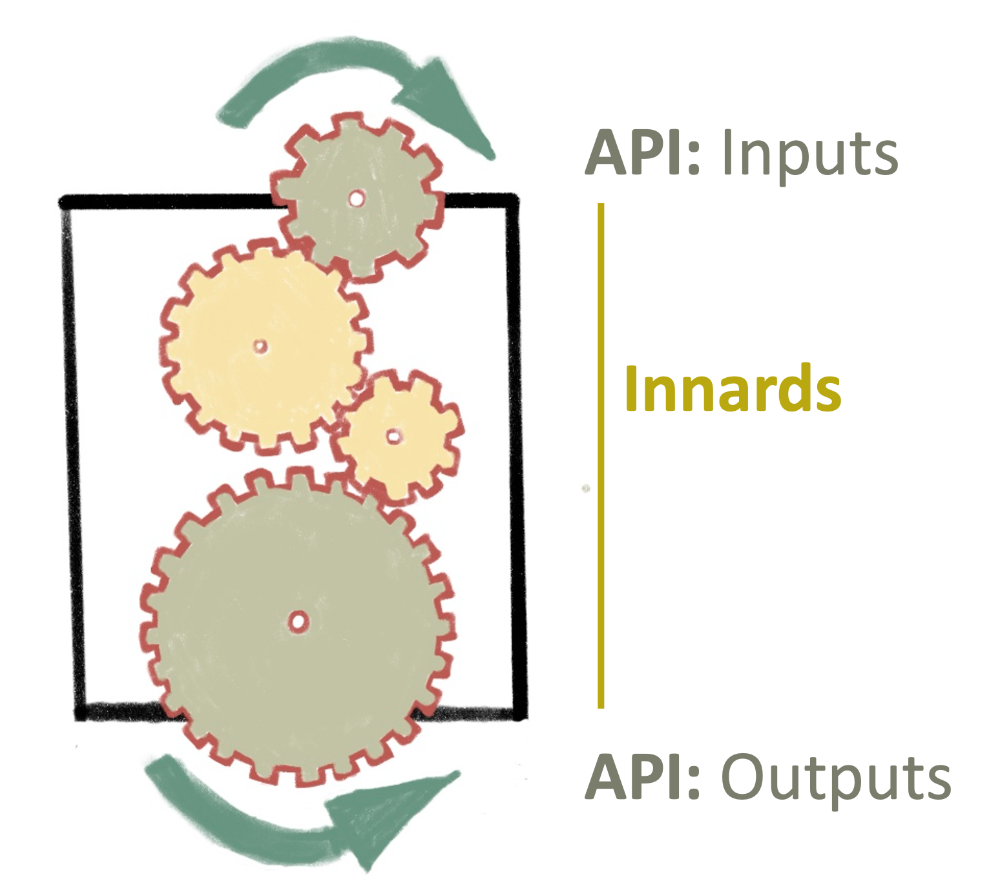
```

## Anatomy of a function 

Another way to think about function anatomy is in terms of (1) the arguments, 
(2) the body, and (3) the environment. Arguments and body are both defined explicitly; 
the function's environment is implicit based on where the function is defined. 
Functions are objects:

```{r out.width = "0.7\\textwidth", fig.align = "center", echo = FALSE}
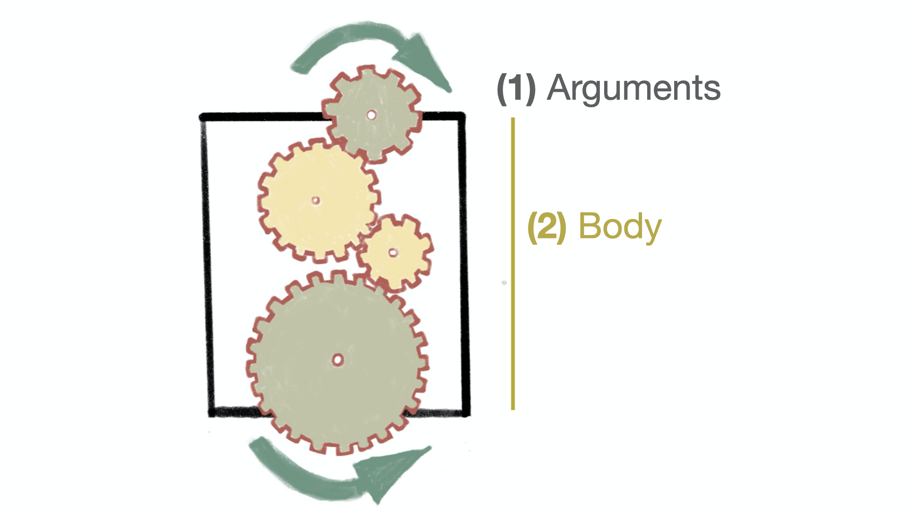
```

## Anatomy of a function 

The Application Programming Interface (API) of the function is the interface
that you'll use when you apply the function---what do you put into and get
out of the function?

```{r out.width = "0.9\\textwidth", fig.align = "center", echo = FALSE}
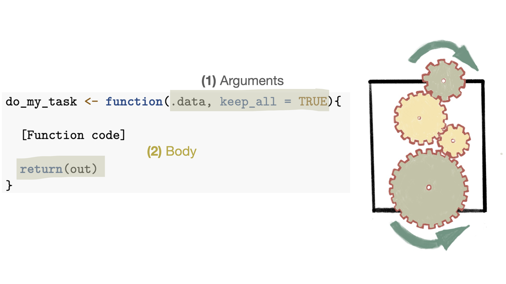
```

Inputs are set within parentheses in the `function` call, while the 
output is specified by `return`. 


## Anatomy of a function

For the function's API, it's help to know that: 

- You can only output one thing from the function. If you have a lot you need 
to get out, you can pack it into a list object to do so (this is why a 
lot of statistical tests and models return a list object)
- There are ways to avoid using `return`, but it's helpful to use it as your 
start writing functions, to make sure you're clear on what you're sending out 
of the function.
- If the API stays stable, the function should work robustly in earlier code
you wrote with it, even if you change some of the details of how the code 
within the function runs.

## Anatomy of a function

The "innards" of the function are the code that is run each time you call the function.

```{r out.width = "\\textwidth", echo = FALSE}
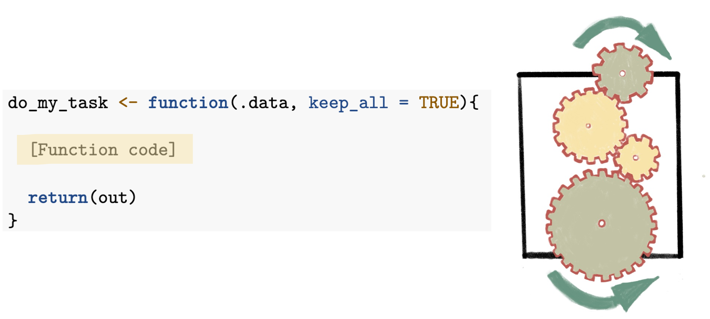
```

## Anatomy of a function

For the innards of the function, it's helpful to know that: 

- R will move to a different R environment when the function runs, so the objects
created within the function code won't show up in your working environment. 
- The environment determines how the function finds the values associated with names
- If the innards include more than one function call, then group them together with 
curly brackets (`{` to start the code for the function, `}` to end it).

# How to build a function

## Writing functions

Functions can be simple, just encapsulating a single, simple (at least to 
simple to describe) step. 

- `mutate`: Change or add a column in a dataframe
- `rename`: Rename a column
- `read_csv`: Read data from a comma-separated file into R
- `str_to_lower`: Convert all characters in a character string to lowercase

## Example: Getting monthly counts of animal response calls

As an example, we'll build a function for one of the tasks in the animal response
call script we edited in the last lab. 

One of the tasks we did was to count the number of calls per month. We'll see 
if we can build a function to do this task.

```{r out.width = "\\textwidth", echo = FALSE}
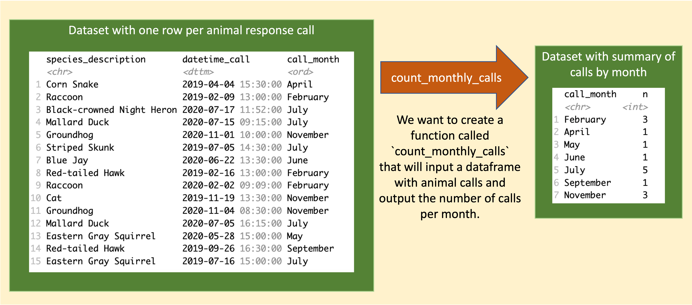
```

## How to name a function

The first step is to pick a name for the function.

Some general tips for naming a function include: 

- Make the name a verb
- Make the name self-documenting (so it means something related to what the function does)
- Use the same prefix for similar functions (tab completion can jog your memory)
- Make sure it's not too long or too short, all lowercase, 
use underscores to help make them more readable 

## Identify relevant code in script

```{r echo = FALSE}
# Load required libraries
library(readr)
library(janitor)
library(dplyr)
library(lubridate)

# Read in data and clean column names
man_animal_resp <- read_csv("../data/Manhattan_animal_response.csv") %>% 
  clean_names() %>% 
  rename(datetime_call = date_and_time_of_initial_call)

# Filter to data on reptiles and amphibians in Central Park
man_animal_resp <- man_animal_resp %>% 
  filter(property == "Central Park") %>%  
  filter(animal_class == "Terrestrial Reptile or Amphibian")

# Filter to years with data covering the full year (2018 and 2021 do not)
man_animal_resp <- man_animal_resp %>% 
  mutate(datetime_call = mdy_hms(datetime_call), 
         call_year = year(datetime_call)) %>% 
  filter(call_year %in% c(2019, 2020))

# Count number of response calls per month
man_animal_resp <- man_animal_resp %>% 
  mutate(call_month = month(datetime_call, 
                            label = TRUE, 
                            abbr = FALSE))
```

Next identify the section of code that you want 
to encapsulate in a function.

If we look at the final script from the last lab, we can find the section
where we calculate the number of response calls per month: 

```{r echo = TRUE}
# Count number of response calls per month
monthly_man_animal_response <- man_animal_resp %>% 
  count(.wt = call_month)
```

## Identify function elements in the code 

Next, we need to identify how this code can be divided into a function, 
specifically into the **API** versus the **innards** of the function. 

We can pick out those parts in the code and highlight them: \medskip

```{r out.width = "\\textwidth", echo = FALSE}
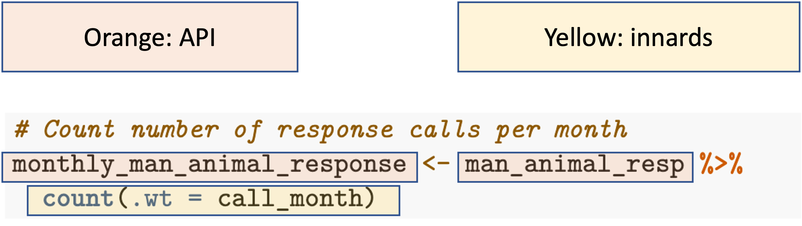
```

## Identify function elements in the code 

In this example the **argument** is the object that's being fed into the **body** of the function: \medskip

```{r out.width = "\\textwidth", echo = FALSE}
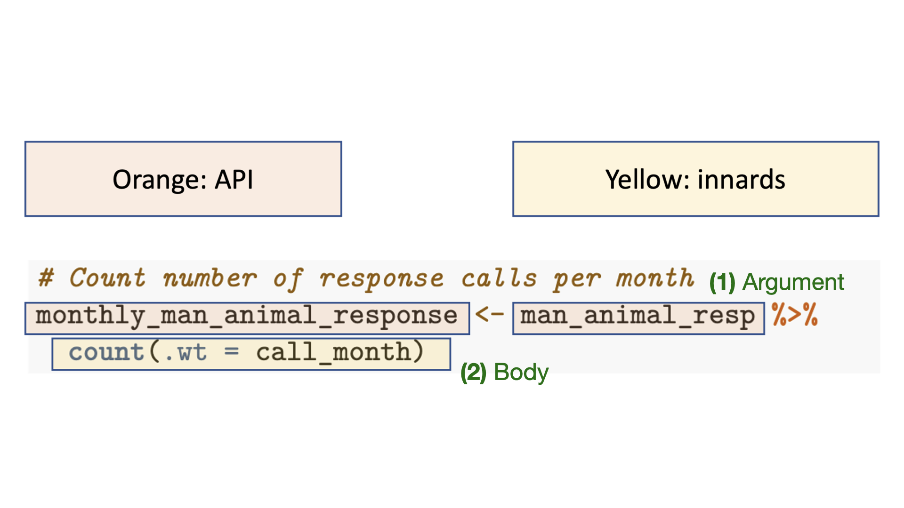
```

## Convert the code to a function 

Now that we've identified the parts, we can build the function from that. 

```{r echo = TRUE}
count_monthly_calls <- function(man_animal_resp) {
  
  monthly_man_animal_response <- man_animal_resp %>% 
    count(.wt = call_month)
  
  return(monthly_man_animal_response)
}
```

## Convert the code to a function 

```{r out.width = "\\textwidth", echo = FALSE}
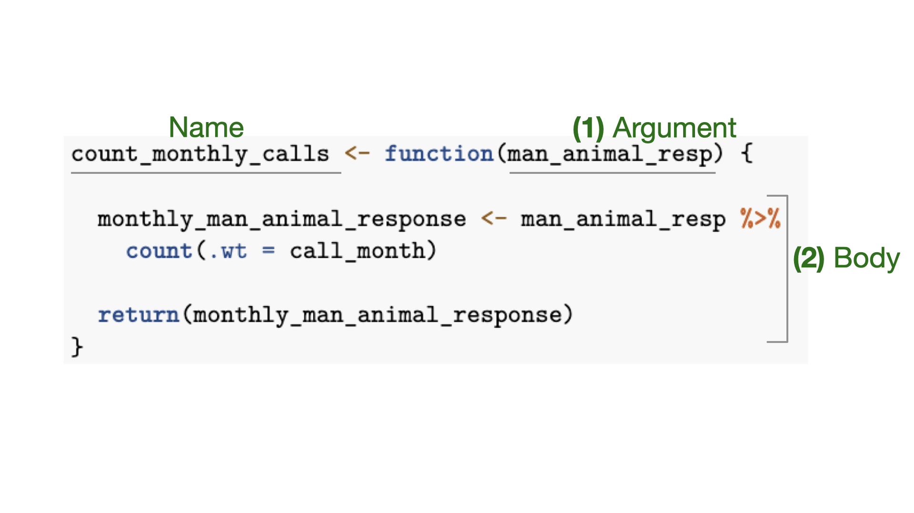
```

## Convert the code to a function

Again, let's use highlighting to think about where the elements from 
the script ended up in the function: 

```{r out.width = "\\textwidth", echo = FALSE}
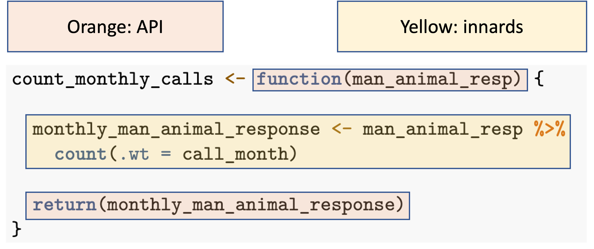
```

## Edit the function

We now have a working function. 

Next, we'll want to make some edits to it to make it easier to understand, 
debug, and use to reproduce analysis.

## Edit to improve object names

We can edit the function to use better, more generic, names. Originally, the input and output
object names were specific to our code script.

We'll change the input parameter `man_animal_resp` to `call_data` and the output
object from `monthly_man_animal_response` to `monthly_calls`:

```{r echo = TRUE}
count_monthly_calls <- function(call_data) {
  
  monthly_calls <- call_data %>% 
    count(.wt = call_month)
  
  return(monthly_calls)
}
```

## How to name function arguments

Here are a couple of things to keep in mind as you decide the names to 
use for function arguments and define them in the function code: 

- Arguments can be either optional (`n = 6`) or required (`.data`)
- Consider using common parameter names (easier for user to figure out what each does
and to remember them)

## Adding package::function notation

Next, we'll update the function to add something that will make
the function more robust when you re-use it or others use it. 

Often, within function code you'll use functions from packages rather
than just base R. There are a few ways to call those functions. In your
scripts, you probably load the library and the call the functions in it
by name, doing something like: 

```{r echo = TRUE, eval = FALSE}
library(pkg)
pkg_function(foo)
```

## Adding package::function notation

However, you can use a different notation to call a function from a package: 

```{r echo = TRUE, eval = FALSE}
pkg::pkg_function(foo)
```

When you use this method, you must have the package installed, but you don't 
need to have it loaded in your current session. 

Also, your code will explicitly get the function from the specified package. If you're
using a function that's included in many packages, this notation will guarantee
which one R uses.

```{r echo = TRUE, eval = FALSE}
stats::filter()
dplyr::filter()
```

## Adding package::function notation

Let's make that change to our function. The `count` function comes from the 
`dplyr` package, so we can use the notation `dplyr::count`. 

```{r echo = TRUE}
count_monthly_calls <- function(call_data) {
  
  monthly_calls <- call_data %>% 
    dplyr::count(.wt = call_month)
  
  return(monthly_calls)
}
```

## Adding help documentation

Since you are using the function to encapsulate and extract a subtask, you will find
it helpful to include some documentation to describe the details of the function, and
you can include that in the code where you define the function. 

Documentation you might want to include: 

- Describe what the function is meant to do
- Document each parameter: What it does, what type of value it can take
- Describe what the output from the function will be
- Consider adding an example of how to use it (ideally with a dataset
that comes with R or an R package)

## Adding help documentation

Here's an example of documentation we might want to add to the code that defines
our function:

```{r echo = TRUE}
# This funtion inputs a dataframe of animal call 
# response data (`call_data`) and returns a 
# dataframe with the counts of animal calls per 
# month. The input dataframe should include a column
# named `call_month` with the month of the call.
# To run this function, you will need to have the 
# following packages installed: dplyr
count_monthly_calls <- function(call_data) {
  
  monthly_calls <- call_data %>% 
    dplyr::count(.wt = call_month)
  
  return(monthly_calls)
}
```

## How to check the function code as you build it

You'll want to try the code out as you work on the function. 
There are different ways to do that, but here's a simple method
as you learn to write functions:

- Create example objects for each of your parameters
- Walk through the code inside the function line-by-line

Getting used to this workflow will also help with debugging.

## How to check the function code as you build it

Let's try that with our example code:

```{r echo = TRUE}
# Set an example for function input parameter(s)
call_data <- man_animal_resp

# Walk through code inside the function
monthly_calls <- call_data %>% 
    count(.wt = call_month)

# Check out the code results as you go
head(monthly_calls, 2)
```


## Improving the function

In the lab, we'll work with a version of the function that we've improved, 
to make sure the output includes all months, even those with zero animal response calls.

```{r out.width = "\\textwidth", echo = FALSE}
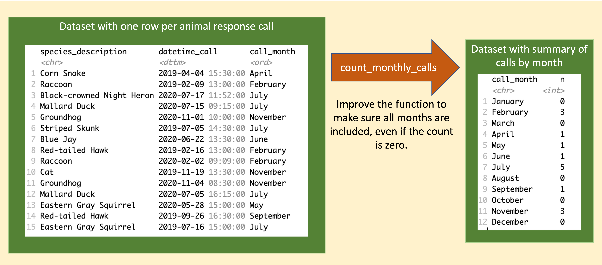
```

## Improving the function

Here is our first version of that improved function code. In a later lab, we'll see
that this is a bit of a "kluge", and we'll work to improve this function even more. 

```{r out.width = "\\textwidth", echo = FALSE}
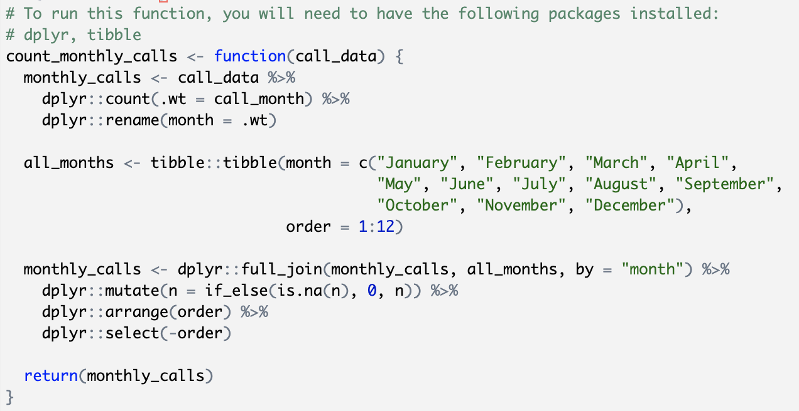
```

# Applying functions with `purrr`

## Mapping a function across values in a list / vector

Even with your own functions, you'll find times when you're repeating code. 
For example, if you write a function to read in data from a file in a certain 
format, and you have many files in that format, you may end up with code like this: 

```{r out.width = "\\textwidth", echo = FALSE}
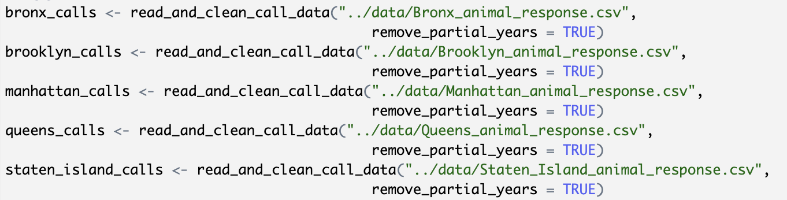
```

## Mapping a function across values in a list / vector

The `purrr` package has a collection of `map` functions that allow you to 
apply a function to all the elements of list or vector at once. 

```{r out.width = "\\textwidth", echo = FALSE}
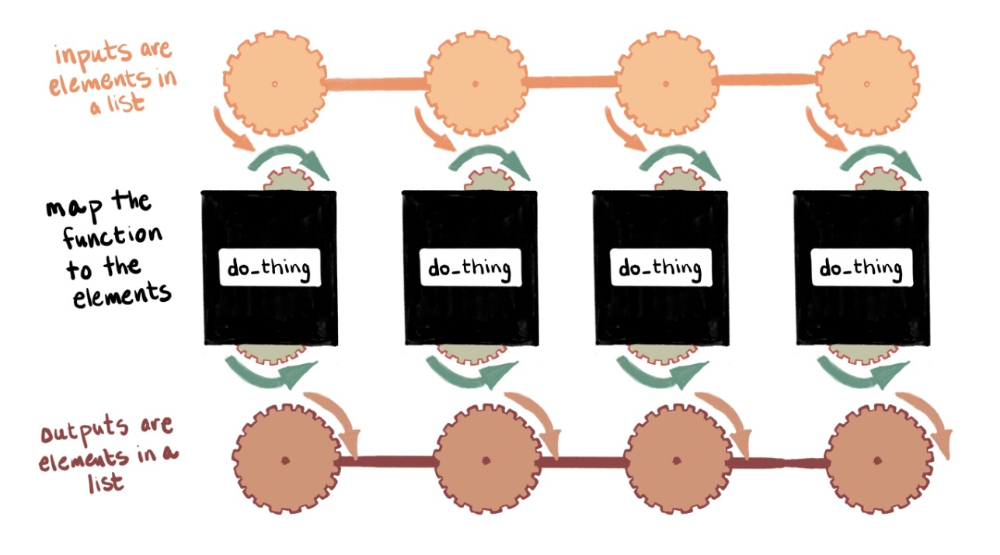
```

## Mapping a function across values in a list / vector

```{r out.width = "\\textwidth", echo = FALSE}
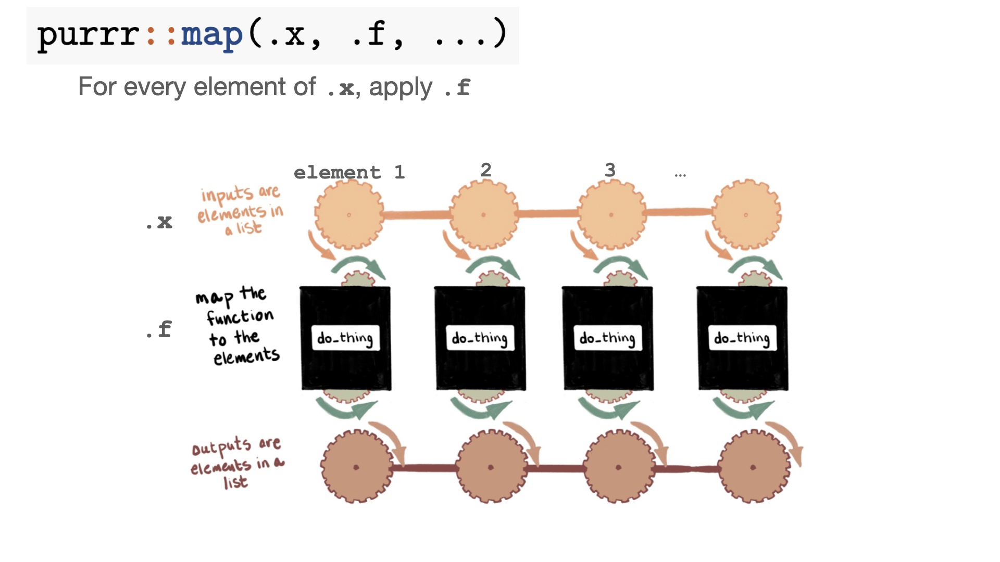
```

## Mapping a function across values in a list / vector

```{r out.width = "\\textwidth", echo = FALSE}
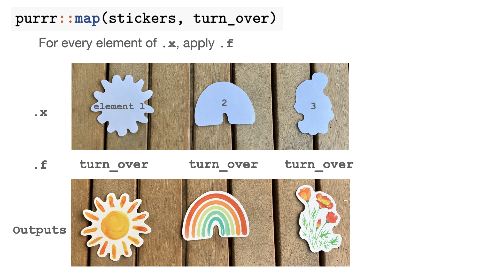
```

## Mapping a function across values in a list / vector

```{r out.width = "\\textwidth", echo = FALSE}
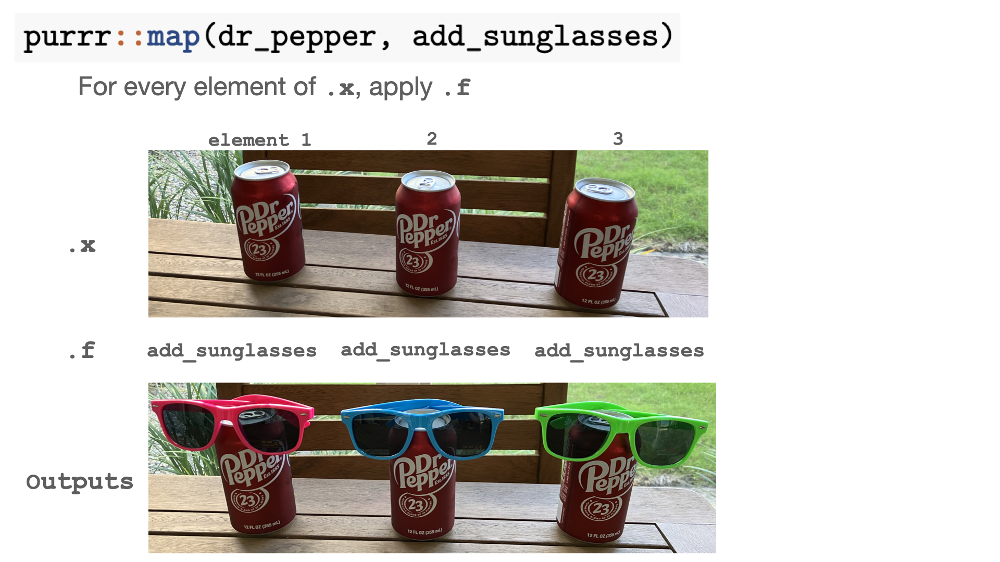
```

## Mapping a function across values in a list / vector

Once you've mastered this approach, you'll feel similar to Mickey Mouse when he
has dozens of brooms working for him in Fantasia (before things get out of control).

```{r out.width = "\\textwidth", echo = FALSE}
knitr::include_graphics("figures/fantasia_brooms.png")
```

## Some applications of mapping

There are many applications of the `map` functions from `purrr`. Two that I see 
often among researchers from a variety of fields are: 

- Reading in lots of files from a directory and joining them into a single 
dataframe: Applying the function along a vector of filenames
- Applying a statistical test or model to many subsets of the data: Nesting
the data by a grouping variable and applying the function to values in a list column 
for each group

## Using `purrr` for functional programming

When you use these `map` functions to apply a function efficiently, it can feel at first
like playing three-dimensional chess. 

```{r out.width = "0.7\\textwidth", fig.align = "center", echo = FALSE}
knitr::include_graphics("figures/StarTrekChess.jpeg")
```

The best way to start to learn this approach is to try it out with some real 
applications, which we'll do in a later lab. 

