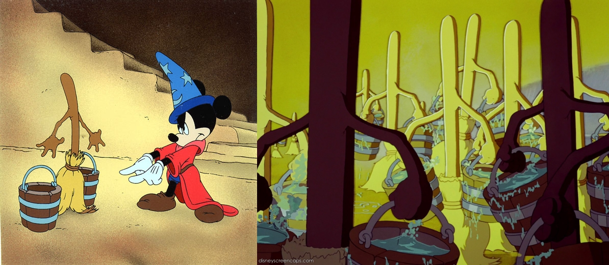

```{r setup, include=FALSE}
knitr::opts_chunk$set(echo = FALSE)
```

# Encapsulating ideas with functions

## Advantages of writing functions

- Fewer lines of code to do the task: Do not repeat yourself
- Separates the code from the logic of the function from the application of it
- More efficient across broader work: Functions can be reused
- Can be documented clearly and throughly
- A step on the path toward writing packages
- Gets you in the habit of breaking up a complex coding task into discrete, 
do-able steps

## Do Not Repeat Yourself

## Encapsulating an idea with a function

[Image---script with all the code]

## Encapsulating an idea with a function

[Image--script with some parts encapsulated as functions]

## Encapsulating an idea with a function

Functions can be simple, just encapsulating a small, simple step. 


# Writing functions

## Example: Getting monthly counts of animal response calls

## What is a function

## Anatomy of a function

Two key elements: API and innards

## Anatomy of a function

API: what you put in and what you get out. 

This is all someone needs to know to be able to use the function (although
it's always nice if they have an idea of what happens in between). 

If the API stays stable, the function should work robustly in earlier code
you wrote with it, even if you change some of the details of how the code 
within the function runs.

## Anatomy of a function

Inputs are set within parentheses in the `function` call: 

```{r eval = FALSE}
do_my_task <- function(.data, keep_all = TRUE){
  
  [Function code]
  
  return(out)
}
```

## Anatomy of a function

The output is specified by `return`: 

```{r eval = FALSE}
do_my_task <- function(.data, keep_all = TRUE){
  
  [Function code]
  
  return(out)
}
```

## Anatomy of a function

- You can only output one thing from the function. If you have a lot you need 
to get out, you can pack it into a list object to do so (this is what a 
lot of statistical tests and models return a list object)
- There are ways to avoid using `return`, but it's helpful to use it as your 
start writing functions, to make sure you're clear on what you're sending out 
of the function.

## Anatomy of a function

Innards: What is run each time you call the function.

R will move to a different R environment when the function runs, so the objects
created within the function code won't show up in your working environment. 

If the innards include more than one function call, then group them together with 
curly brackets (`{` to start the code for the function, `}` to end it).

## How to build a function

## How to check the function code as you build it

- Create example objects for each of your parameters
- 

## Adding package::function notation

`library(pkg)` and then `pkg_function(foo)`

versus

`pkg::pkg_function(foo)`

## Adding package::function notation

Why do this?

More robust in new R sessions (isn't counting on previous calls in the session
to load the package). Similarly, more robust when someone copies and pastes
the function to use elsewhere (you or someone else). 

## Adding help documentation

- Describe what the function is meant to do
- Document each parameter: What it does, what type of value it can take
- Descripe what the output from the function will be
- Consider adding an example of how to use it (ideally with a dataset
that comes with R or an R package)

Notice that this is getting similar to a helpfile for a function 
in a package. 

## Functions as part of a pipeline

You can include your own functions in a pipeline of code, including one 
based on a tidyverse approach. 

## Functions as part of a pipeline

To make it easier to use a function in a pipeline, plan to: 

- Have the function operate on one of two object types: a dataframe or a vector 
(which equates to a column in a dataframe)
- Make sure that the output is the same type of object as the input. This 
is a key characteristic of the small, simple tools approach of the tidyverse
because it allows you to combine strings of function calls in different orders

## How to name a function

- Verb
- Self-documenting: name means something
- Use the same prefix for similar functions (tab completion can jog your memory)
- Similar to naming objects: Not too long or too short, all lowercase, 
use underscores to help make them more readable

## How to name function arguments

- Optional versus required arguments
- Use common parameter names (easier for user to figure out what each does
and to remember them)

# Applying functions with `purrr`

## Mapping a function across values in a list / vector

## Mapping a function across values in a list / vector

```{r out.width = "\\textwidth", echo = FALSE}

```

## Nesting and mapping

## Some applications of mapping

- Reading in lots of files from a directory and joining them into a single 
dataframe: Applying the function along a vector of filenames
- Applying a statistical test or model to many subsets of the data: Nesting
the data by a grouping variable and applying the function to values in a list column 
for each group

