```{r setup, include=FALSE}
knitr::opts_chunk$set(echo = FALSE)
```

# Finding example code

## Finding example code

```{r out.width = "0.45\\textwidth", echo = FALSE}
knitr::include_graphics("figures/googling_error_message.jpeg")
knitr::include_graphics("figures/copying_stackoverflow.jpeg")
```

## The art of Googling for code

- Learn some Google search operators 
  + Quotation marks force a match to an exact term or phrase
  + A negative sign excludes a word, returning only matches that don't include that word
- If you get an error message in R, Google it (take out anything specific to 
your problem, like a filepath or object name)
- Hone your search terms
  + Continue to improve the precision of your coding vocabulary
  + Pay attention to the language advanced coders use 
  + Refine your search terms based on what Google returns from your first search

## The art of Googling for code

There are a variety of tips that can help you improve your Googling. Some resources include:

- **Advanced Google searching, including search operators**: https://support.google.com/websearch/answer/2466433?hl=en
- **21 Tips and Tricks to Master the Art of Googling as a Developer**: 
https://www.makeuseof.com/21-tips-and-tricks-to-master-the-art-of-googling-as-a-developer/
- **How to Google effectively as a developer**: https://medium.com/@niamhpower/how-to-google-effectively-as-a-developer-4ebe363afe
- **Googling for code solutions can be tricky---here's how to get started**: https://knightlab.northwestern.edu/2014/03/13/googling-for-code-solutions-can-be-tricky-heres-how-to-get-started/

## Where you may find example code

Once you have submitted a good Google search, you should be able to get some
promising leads for most R coding tasks. 

Some of the types of resources that may have example code include: 

- Help forums: StackOverflow, Posit Community
- Package documentation: vignettes, helpfiles (e.g., `?stringr`), cheatsheets
- Blog posts (especially those written with blogdown)
- AI: e.g., ChatGPT (https://openai.com/blog/chatgpt)

## Cheatsheets

```{r out.width = "\\textwidth", echo = FALSE}
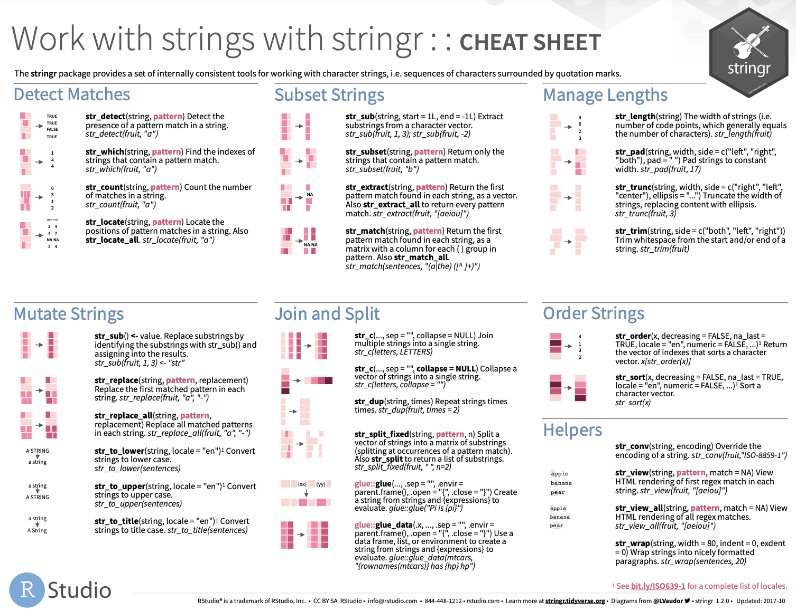
```

## 

```{r out.width = "\\textwidth", echo = FALSE}
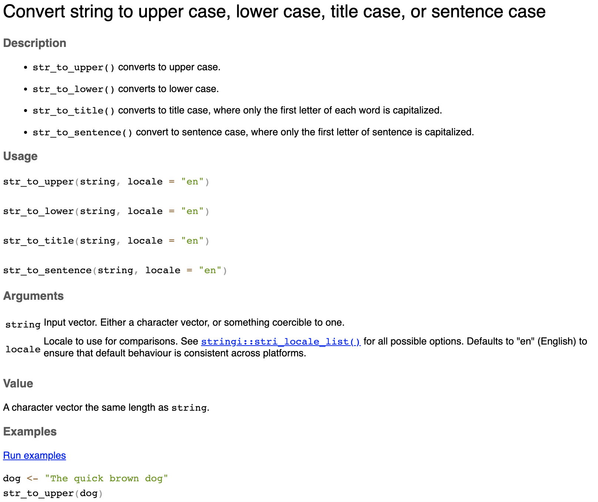
```

## Finding R packages

If you are trying to do a specialized task, you may find that you need to 
find a new R package with the appropriate algorithms. There are steps you can 
take to identify and evaluate packages for specific tasks.

```{r out.width = "\\textwidth", echo = FALSE}
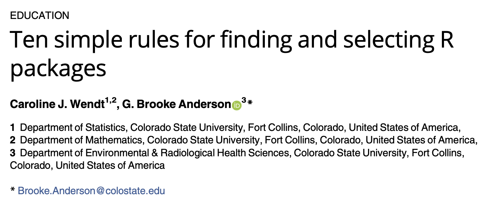
```

https://journals.plos.org/ploscompbiol/article?id=10.1371/journal.pcbi.1009884

## Finding R packages

This paper includes detailed suggestions for how to find and evaluate R packages, 
so you can pick the best package to tackle your task. Some of the rules that
are described include: 

- Rule 4: Explore the availability and quality of help
- Rule 5: Quantify how established it is
- Rule 6: Seek evidence of peer acceptance and review
- Rule 8: See how it’s developed

# Dissecting example code

## Getting example code to work

Start by trying the full piece of code. 

Does the example run? If not, 
try these steps first: 

- Make sure you have all the packages that are used in the example 
installed on your computer
- If there is information on the package versions from the example, 
compare your versions to those used in the example
- Make sure that you have the example data and it's being loaded or 
set up correctly in R


## Dissecting example code

The next step is to go through the example carefully to make sure you 
understand what it's doing. 

- Run through code step-by-step. Take apart pipelines if necessary
- For each step, what does input look like? What does output look like?
- Make sure you understand why each function is being called and why 
any arguments are being used

## Dissecting nested code

In R, you'll often find examples of code (and write them yourself) 
where a function call is nested within another function call. 

For example, in the following example code, a `function1` call is nested 
inside a `function2` call: 

```{r echo = TRUE, eval = FALSE}
function2(function1(my_data, n = 5), verbose = TRUE)
```


## Dissecting nested code

If you are trying to figure out a line of code with nested code, dissect
it from the inside out. 

Start by figuring out what the innermost function call is doing. For the 
moment, ignore everything except the nested function call. 

```{r out.width = "\\textwidth", echo = FALSE}
knitr::include_graphics("figures/nested_inner.jpg")
```

## Dissecting nested code

Once you have figured out the innermost function call, you can think of 
that part of the code line as its output. 

Now you can proceed to figure out the outer function call.

```{r out.width = "\\textwidth", echo = FALSE}
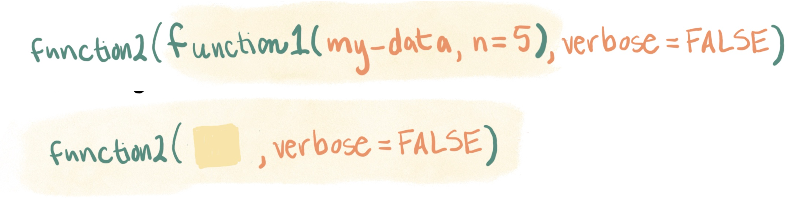
```

## Dissecting piped code

Often, an example will include a series of piped functions calls. 

```{r echo = TRUE, eval = FALSE}
my_data <- my_data %>% 
  rename(better_name = `Bad Name!`) %>% 
  mutate(animal_species = fct(animal_species))
```

In this type of piped code, the output of one function call is sent directly 
as input into the next function call. 

## Dissecting piped code

This type of code can be very clear and efficient in performing a series of
simple steps. However, it's useful to have some strategies for how to dissect
example code that is in a pipeline, as this isn't always as straightforward. 

It's a good strategy to dissect the code line by line. Figure out everything up to 
the first pipe before you look at the next line up to the next pipe, and so on. 

## Dissecting piped code

For the example code, you could start just by looking at the data input to the first
pipe. In RStudio, you can do this by highlight only that dataframe name (`my_data`)
and clicking the Run button (or using the keyboard shortcut for "Run"): 

```{r out.width = "\\textwidth", echo = FALSE}
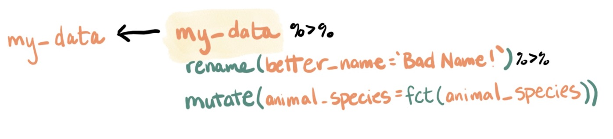
```

## Dissecting piped code

Once you understand that much, you can add on the next function call in the pipe. 
Highlight the code, starting from the input to the pipe and going up to (but not
including) the pipe after the last call you want to assess. 

```{r out.width = "\\textwidth", echo = FALSE}
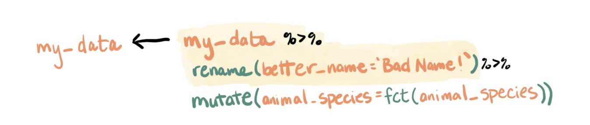
```

## Dissecting piped code

If one of the function calls in the pipeline includes another function call nested
inside, use the techniques for nested function calls to dissect that part of the 
code. 

Start with the inner function call:

```{r out.width = "\\textwidth", echo = FALSE}
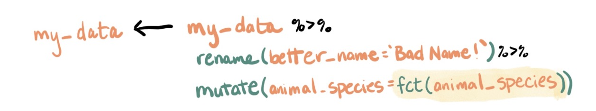
```

Then dissect the outer function call:

```{r out.width = "\\textwidth", echo = FALSE}
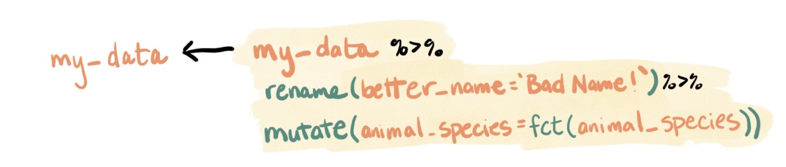
```

## Dissecting piped code

Some nested function calls will operate on a single column of the dataframe, 
rather than the whole dataframe. In those cases, you can use the `pull` function 
to investigate the inner function.

For example, to explore this: 

```{r out.width = "\\textwidth", echo = FALSE}

```

You can use: 

```{r echo = TRUE, eval = FALSE}
my_data %>% 
  rename(better_name = `Bad Name!`) %>% 
  pull(animal_species) %>% 
  fct()
```

## Dissecting piped code

If the pipeline overwrites an earlier object, it will usually be best to not run 
the assignment part of the pipeline until you have dissected all of the rest of the
code in the pipeline. 

```{r out.width = "\\textwidth", echo = FALSE}
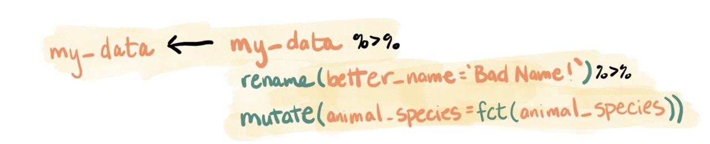
```

## Full process of dissecting piped code

```{r out.width = "\\textwidth", echo = FALSE}
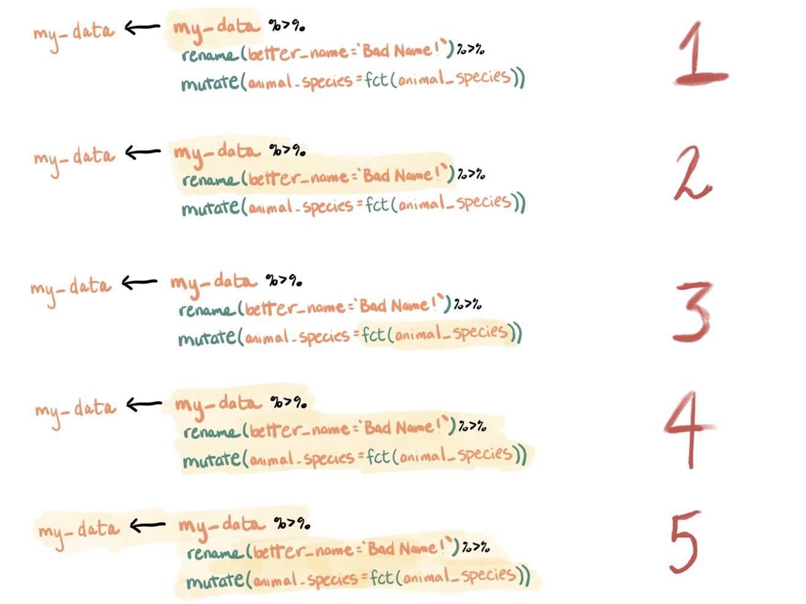
```

## Can you spot the differences?

If the function call outputs a revised version of the original object, compare
that object before and after the call to make sure you understand how it's changed.

```{r echo = TRUE}
library(stringr)
fruit <- c("apple", "bell pepper", "coconut")

fruit
str_to_title(fruit)
```


## Can you spot the differences?

```{r out.width = "\\textwidth", echo = FALSE}

```

## Try changing parameters

```{r out.width = "0.7\\textwidth", fig.align = "center", echo = FALSE}
knitr::include_graphics("figures/changing_stuff.jpeg")
```

# Adapting example code

## Adapting example code

Two steps: 

1. Get it to work
2. Edit it to make it more robust and reproducible

R coders often stop after the first step. This can lead to code that's 
hard to debug and maintain and that's likely to fail in the future. 

## Adapting example code

```{r fig.show = "hold", out.width = "42%", fig.align = "center", echo = FALSE}
knitr::include_graphics("figures/hoping_this_will_work.jpeg")

```

## Adapting example code

Practical approaches: 

- How does your data compare to the example data they use? How do you 
need to change it's format (or the example code) so it will work with the
example code?
- Are there functions in the example code that are not in your normal set
of tools? Could they be replaced with something in your usual toolset?

## Adapt to your tools

We talked in the introductory lecture about how you should have a set of
core tools that you know well and use often. 

When you pull code from an example, it's useful to edit it to use your set
of core tools if it doesn't already. 

## Adapt to your tools

You gain several advantages by editing code to use your own toolset: 

- Bugs are less likely (especially since defaults can be different across
R functions that other perform similar actions)
- If there are bugs, you will catch them more quickly
- The code will be easier for you to understand in the future

## Adapt to your tools

For example, you might find an example of how to change a column in your 
data to a factor data class. 

The example might be written using base R functions: 

```{r echo = TRUE, eval = FALSE}
df$borough <- as.factor(df$borough)
```

If you tend to use tidyverse tools as your core toolset, you could edit
the example to use those tools: 

```{r echo = TRUE, eval = FALSE}
df <- df %>% 
  mutate(borough = fct(borough))
```


## What is a kluge? 

From the Jargon File, a kluge is: 

> "A clever programming trick intended to solve a particular nasty case in an expedient, 
if not clear manner... Often involves ad-hackery..." 

or

> "Something that works for the wrong reason"

http://catb.org/jargon/html/K/kluge.html

## What is a kluge?

A classic example of a kluge is a Rube Goldberg machine.

```{r out.width = "\\textwidth", echo = FALSE}
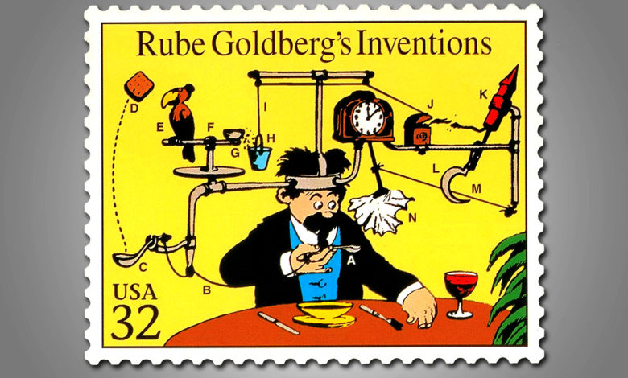
```

## What is a kluge?

Kluges can also be clever, but put together in a way that uses 
materials in unintended ways and that takes a while to understand. 

```{r out.width = "0.9\\textwidth", fig.align = "center", echo = FALSE}
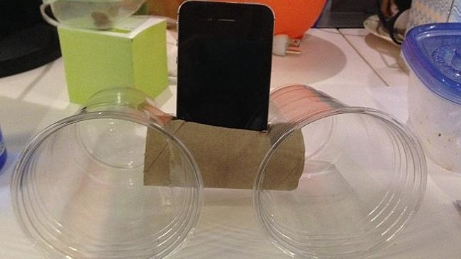
```

This type of kluge is famous from the TV series MacGyver.

## What is a kluge?

Other kluges are clearly going to fall apart at some point, probably in 
a dramatic and dangerous way.

```{r out.width = "0.49\\textwidth", echo = FALSE}
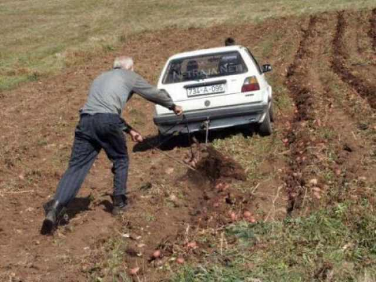

```

These types of kluges are often described with, "There I Fixed It". 

## Find and fix kluges

> "The essence of proper kluge building is the designer who is so clever 
that he outwits himself. ---“How to Design a Kluge”, *Datamation* magazine

You want to edit out kludges because: 

- They often use longer code than you need.
- The logic of the code is not clearly linked to the logic of the problem
- They are hard to maintain, understand, and debug
- Some are strongly predisposed to fail unpredictably and dramatically

Don't prioritize **concision** or **efficiency** over **clarity**.


