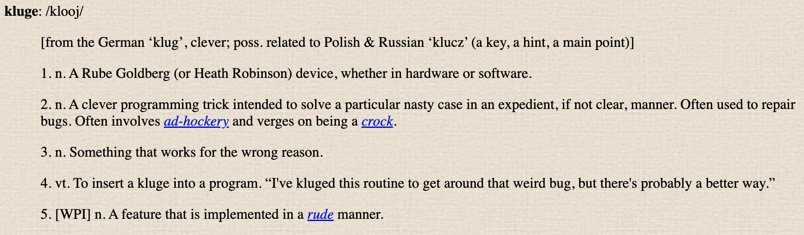

```{r setup, include=FALSE}
knitr::opts_chunk$set(echo = FALSE)
```

# Finding example code

## Help forums

StackOverflow

RStudio (posit?)

## Vignettes and helpfiles

## Cheatsheets

## Blogs and articles

## ChatGPT (?), other AI

## Finding code for specialized tasks

How to find and evaluate R packages: article

# Dissecting example code

## Getting example code to work

Start by trying the full piece of code. Does the example run? If not, 
try these steps first: 

- Make sure you have all the packages that are used in the example 
installed on your computer
- If there is information on the package versions from the example, 
compare your versions to those used in the example
- Make sure that you have the example data and it's being loaded or 
set up correctly in R

If it still won't run, you may have to work through it to find out

## Dissecting example code

- Run through code step-by-step. Take apart pipelines if necessary
- For each step, what does input look like? What does output look like?
- Make sure you understand why each function is being called and why 
any arguments are being used

## Dissecting example code

Assess the code as you go: 

- Why does it do each step?
- If the steps are inputting and outputting the same thing (e.g., a 
dataframe), how does that object change from before to after the call?

## Dissecting nested code

Work from the inside out

## Can you spot the differences?

If the function call outputs a revised version of the original object, compare
that object before and after the call to make sure you understand how it's changed.

```{r echo = TRUE}
library(stringr)
fruit <- c("apple", "bell pepper", "coconut")

fruit
str_to_title(fruit)
```


## Can you spot the differences?

```{r out.width = "\\textwidth", echo = FALSE}
knitr::include_graphics("figures/spot_the_difference_halloween.jpg")
```

# Adapting example code

## Adapting example code

Two steps: 

1. Get it to work
2. Edit it to make it more robust and reproducible

## Adapting example code

Practical approaches: 

- How does your data compare to the example data they use? How do you 
need to change it's format (or the example code) so it will work with the
example code?
- Are there functions in the example code that are not in your normal set
of tools? Could they be replaced with something in your usual toolset?

## Getting example code to work on your task

## Editing example code for rigor and reproducibility

## What is a kluge? 

From the Jargon File: 

```{r out.width = "\\textwidth", echo = FALSE}

```

## What is a kluge?

A kluge by Rube Goldberg:

```{r out.width = "\\textwidth", echo = FALSE}
knitr::include_graphics("figures/rube_goldberg.jpeg")
```

## What is a kluge?

A kluge to make an iPhone speaker (MacGyver-style kluge):

```{r out.width = "\\textwidth", echo = FALSE}
knitr::include_graphics("figures/speaker_kludge.jpeg")
```

## What is a kluge?

A kluge for plowing a field (a "There I Fixed It"--style kluge): 

```{r out.width = "\\textwidth", echo = FALSE}
knitr::include_graphics("figures/kluge_plow.jpeg")
```

## What is a kluge?

A kluge for fixing a bike (a "There I Fixed It"--style kluge): 

```{r out.width = "\\textwidth", echo = FALSE}
knitr::include_graphics("figures/kluge_bike.jpg")
```

## What is a kluge?

> "There isn't much to say about the blog "There I Fixed It", other than that you should add it to your RSS reader immediately. It's a gallery of user-submitted hacks, the twist being that these hacks are disastrous, usually dangerously so, and many of them could quite possibly end in death." --- Wired Magazine, https://www.wired.com/2009/07/there-i-fixed-it-gallery-of-dangerous-hilarious-hacks/

## Find and fix kluges

> "The essence of proper kluge building is the designer who is so clever 
that he outwits himself. ---“How to Design a Kluge”, *Datamation* magazine

You want to edit out kludges because: 

- They often use longer code than you need.
- The logic of the code is not clearly linked to the logic of the problem
- They are hard to maintain, understand, and debug

Don't prioritize **concision** or **efficiency** over **clarity**.


