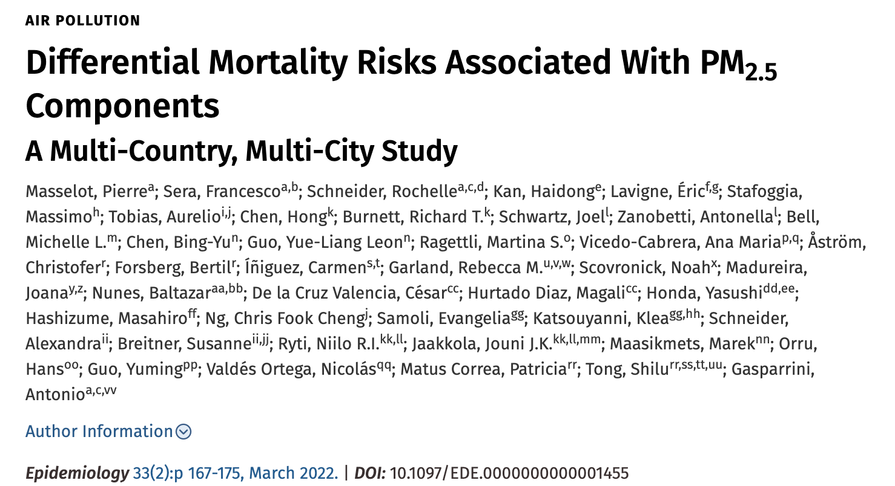
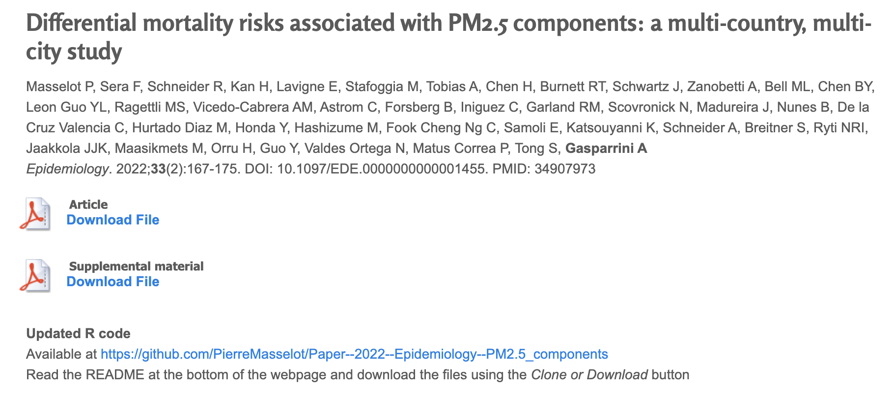
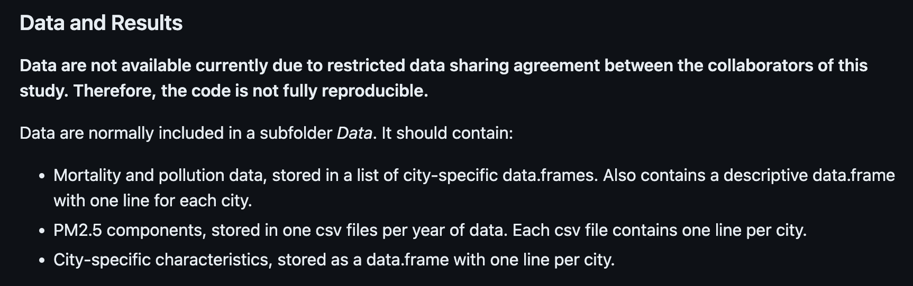

```{r setup, include=FALSE}
knitr::opts_chunk$set(echo = TRUE)
```

## What to include with a computationally reproducible paper?

Remember, to be computationally reproducible, the reader must be able to start
from the data that were collected and arrive at the same results, including 
tables and figures. 

- All data used in analysis in the paper
- All code to get from these data to the results shown in the paper
- Any environmental information (e.g., package versions) that are necessary 
for the code to generate the results

## Sharing code and data

There are a few options for how you share the code and data for the paper, including: 

- Supplemental files through the journal's website
- GitHub
- Scientific repository, like [examples, NIH]
- Personal / academic website 
- R package plus script

## What to include with a computationally reproducible paper?

It's also helpful to include: 

- Adequate documentation for the user to recreate the results from the 
data using the code and environmental information
- Guidance on how the code can reused (license)

## Data to include

[Image: raw data to processed data to right before tables / figures]

## Extremely large data

- Repositories built for data curation might be better suited for storing
data that methods with data size limits ([example])
- Some repositories might have APIs---data can be downloaded programatically 
(from the code script), so the code could be connected to the data in this way
- Some repositories allow options to toggle private versus public (similar to 
GitHub)

## Sensitive or protected data

```{r out.width = "\\textwidth", echo = FALSE}

```

https://journals.lww.com/epidem/Abstract/2022/03000/Differential_Mortality_Risks_Associated_With_PM2_5.3.aspx

## Sensitive or protected data

```{r out.width = "\\textwidth", echo = FALSE}

```

http://www.ag-myresearch.com/2022_masselot_epidemiol.html

## Sensitive or protected data

```{r out.width = "\\textwidth", echo = FALSE}

```

From the GitHub repository  
https://github.com/PierreMasselot/Paper--2022--Epidemiology--PM2.5_components

Masselot P, et al. Differential mortality risks associated to PM2.5 components: a multi-country multi-city study. Epidemiology. 2022.

## Sensitive or protected data

- Can include mock dataset (same format, different numbers) to use to test and 
demonstrate the function of the code
- Can use .gitignore to include the data in a git repo on a local computer 
(or a secure server you're working on) but not push it to remote versions of that
repo, like one on GitHub
- When working on a server for security reasons, it can be helpful to have 
RStudio Server installed, as this provides a friendlier interface for working with 
git version control on the server (avoids having to do much from the terminal)


## Sensitive or protected data

If you look through the repository for Masselot P, et al. 2022, you'll see that they
listed all data in the ".gitignore" file. This would allow them to have the data on 
their local computer but not share it publicly with the rest of the repo.

```
# Session Data files
.RData
**/*.RData

# RStudio files
.Rproj.user/

# produced vignettes
vignettes/*.html
vignettes/*.pdf

# Other
Data/
```

https://github.com/PierreMasselot/Paper--2022--Epidemiology--PM2.5_components/blob/master/.gitignore

## Processed data versus raw data

A lot of health-related data can require extensive pre-processing to 
extract the information you need to answer a scientific question. 

It is helpful to include the original, raw data and the code used to get
to the processed data. 

## Saving intermediate data

It can be useful to save intermediate versions of the data, as the code moves
from raw data to the final figures, tables, and other results. Intermediate data
can include: 

- Processed data (e.g., if raw data are from flow cytometry, the results
after gating and counting the data)
- Data points that are plotted in figures (i.e., data at the point immediately 
before it is graphed)

Note that this is in addition to the raw data.

For these intermediate data sets, it's helpful if you save them in plain text
formats (e.g., ".csv" or ".txt" file). 

(Sandve et al.)

## Types of shared documents

There are several formats that you can use to share the files that are needed
to make an article reproducible. These include: 

- A set of unstructured files
- A compressed directory, providing both the files and their organization into 
a directory. This can include an online repo maintained through a version
control platform.
- A container, including everything provided with a compressed directory
as well as the code fo the software needed to run the code
- An interactive platform, where the user can re-run code, as well as adapt
and explore the code and data, through a web-based platform without needing
to download the data

## Set of unstructured files

[Image---list of supplemental files from journal articles]

## Compressed directory

[Image---GitHub]

Full directory can be shared in one compressed file. 

Includes not only all the files, but also maintains the organization of 
those files into a directory. 

## Compressed directory

There are advantages to solutions that let you share everything as a directory: 

- Relative pathnames work in scripts (because directory structure is preserved)
- If you set up your directory as an R Project, it's designed to be self-contained
(can interact with other things in the directory but doesn't rely on the computer's
file directory outside of that)

## Container

Includes all files and directory organization. Also includes all software
needed to run code (including operating system?). 

Downsides: 

- Can be very, very large
- Can be somewhat of a black box, in terms of dissecting what's in the container
- Can be hard to adapt parts for new tasks (often relies on code that might
be out of date)

## Considering containers

Containers can get very large---stores not just info on the versions of each 
piece of software used, but full source code (?)

Works somewhat like a black box---harder for users to explore, change, adapt

Can be useful, though, if using a large collection of different open-source
software (command line tools, R, Python, etc., all in the same pipeline)

## Interactive platform

Not only shares the data and code, but allows it to be explores (e.g., change
and test code) on the platform. 

- NSF Disaster data platform
- Galaxy?
- Immunoport?

## GitHub as a method for reproducible papers

There are advantages and disadvantages to each method. However, if you 
are new to making papers computationally reproducible, sharing through 
GitHub or a similar platform might be a good place to start. 

## GitHub as a method for reproducible papers

- Allows you to set up the online copy of the project directory while
you're working on the project
- This can facilitate collaborative work on the project, as well as 
provide a form of backup as you work
- You can toggle the GitHub repo from private while you work on your project
to public once you submit it for publication
- This system is widely used, so there are many resources available to 
help you navigate it

## Leveraging a sharing system before you publish

Some of these methods are platforms that you can use before you publish, and they 
can help you work on code-heavy projects within your team. GitHub is one example, 
but some agency-funded platforms now combine repositories with workspaces for coding. 

For GitHub (and some of the agency-funded platforms), you can toggle between having
your data and code be public or private. This allows you to work privately before you 
publish, but then switch the repository to public when you publish the paper. 

This can be much easier than trying to figure out how to post everything after publication.
It also provides some helpful tools as you work on the paper.

## GitHub as a method for reproducible papers

Resources for git and GitHub with R and RStudio: 

- [Jenny Bryan's webpage]
- [something in R for data science?]
- [something on RStudio stie]

## Versions of software

R base code changes from one version to another. 

The code within packages can change even more. 

Seems to be a particular source of difficulty in reproducing for work that 
involves Bioconductor packages.

## Versions used in original analysis

You can record the information on all versions of the R software you 
used in your analysis (base R and packages). 

`session_info` from `devtools` (or `sessionInfo` from base R)

Include this as a line in an RMarkdown file (often at the end), and it will
print out the information on versions. 

## Versions used in original analysis

Help user recreate the "environment" that code ran in originally

If you have version numbers, you could do it by hand (all old versions of
CRAN packages, for example, are archived and avaiable for you to install, 
although it takes a bit more work that installing the current version of 
the package).

[Packrat alternatives]

## Deprecated functions

Future-proof your code (or at least make it robust for longer)

## Absolute versus relative pathnames

## Reproducing randomness

[Dice, roulette wheel]

## Reproducing randomness

```{r out.width = "\\textwidth", echo = FALSE}
knitr::include_graphics("figures/random_digits.jpeg")
```

## Reproducing randomness

```{r out.width = "\\textwidth", echo = FALSE}
knitr::include_graphics("figures/lava_lamps.jpeg")
```

## Reproducing randomness

pseudorandom number generator

## Reproducing randomness

You might be using random numbers if you: 

- are sampling
- are using the Monte Carlo method / simulations
- are doing Bayesian statistics

## Reproducing randomness

Setting seeds when code includes random number generation

Seed can be any integer

Pseudorandom number generator---depends on an initial value (the seed)

## Reproducing randomness

If you don't set a seed, you will get different results when you run code that 
involves random number generation, because of the randomness involved. 

```{r}
sample(1:5)
sample(1:5)
```

## Reproducing randomness

If you set the same seed each time before you run that code, you will get the same
"random" results:

```{r}
set.seed(100)
sample(1:5)

set.seed(100)
sample(1:5)
```

## Reproducing randomness

```{r}
set.seed(100)
sample(1:5)

sample(1:5)
```

## RMarkdown for journal articles

## rticles templates

## How to collaborate when using RMarkdown

Guidelines: 

- Be sure even treats the output (pdf, HTML, Word) as read-only. Only make edits
to the RMarkdown file
- If using git and GitHub may help to exclude the output file from tracking
(e.g., include in .gitignore)

Platforms: 

- GitHub 
- Overleaf?

