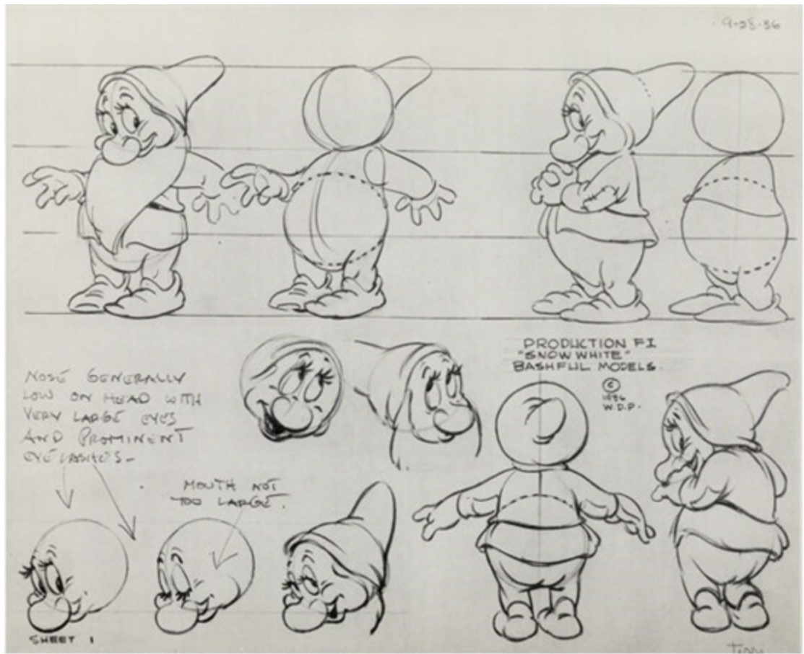
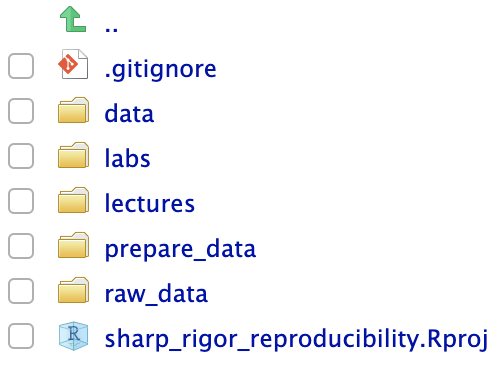
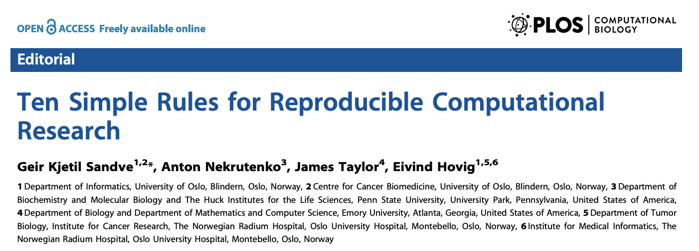
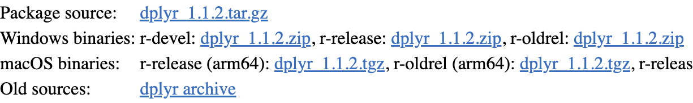
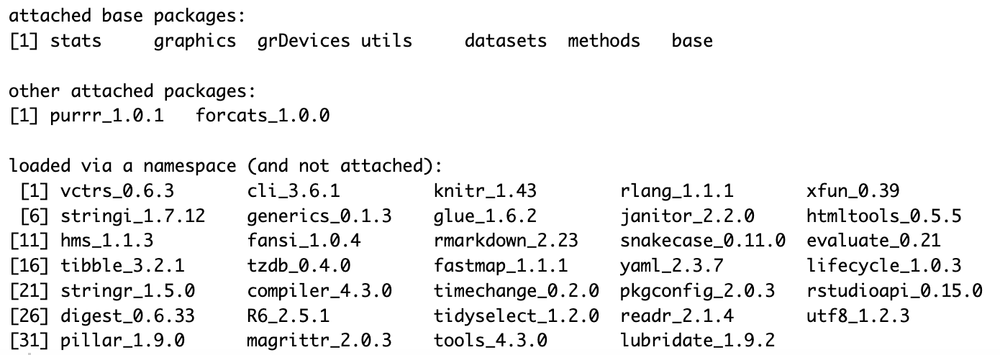
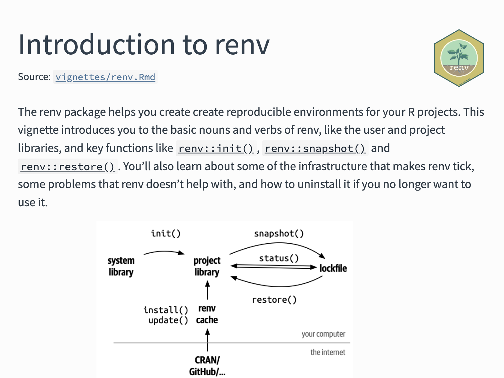
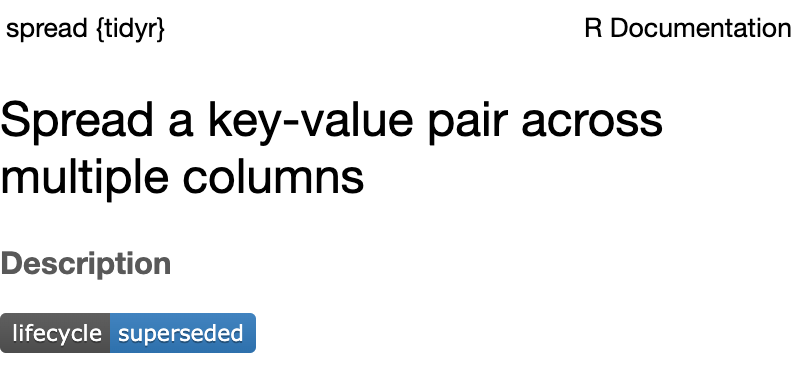
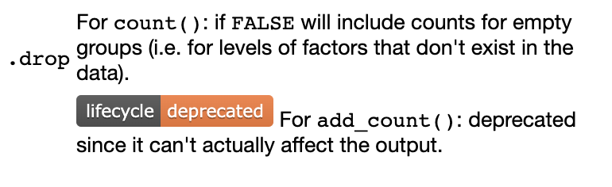

```{r setup, include=FALSE}
knitr::opts_chunk$set(echo = TRUE)
```

## Barriers to reproducible papers

In theory, some of the barriers to making published papers computationally 
reproducible are: 

- Necessary to know what to include and how to share it
- Data are very large
- Data cannot ethically or legally be shared (e.g. private health data)
- Necessary to know how to share important information about the 
enviroment in which the code was run
- Must address randomness introduced by random number generation

We will cover these topics in this session. 

## Barriers to reproducible papers

```{r out.width = "0.9\\textwidth", fig.align = "center", echo = FALSE}

```

## Barriers to reproducible papers

In practice, though, some of the barriers keeping people from making published
papers computationally reproducible are actually:

- I don't want to share the code / data
  + The code's too messy
  + Someone might scoop my work
  + Someone might find a bug
- The code's available, but very hard to understand
  + I'll put the code up, but it's not worth taking the time to clean it first
  + Subconciously creating a barrier to prevent easy reproduction
  
The other sessions of the workshop have focused on approaches that address
these barriers.

## What to include with a computationally reproducible paper?

Remember, to be computationally reproducible, the reader must be able to start
from the data that were collected and arrive at the same results, including 
tables and figures. 

- All data used in analysis in the paper
- All code to get from these data to the results shown in the paper
- Any environmental information (e.g., package versions) that are necessary 
for the code to generate the results

It's also helpful to include: 

- Adequate documentation for the user to recreate the results from the 
data using the code and environmental information
- Guidance on how the code can reused (license)

## Including data for the paper

Ideally, you will include all the data that were used to generate the paper's
results. 

However, sometimes there are challenges with including some or all of the data. 
These include: 

- Data cannot be legally or ethically shared
- Data are very large

## Sensitive or protected data

If your research includes human health data or other types of sensitive or 
protected data, you may not be able to publish that data. 

As a result, you will not be able to make your paper fully computationally 
reproducible. 

However, if you consider reproducibility as a spectrum, there 
are steps you can take to make the paper *more* computationally reproducible, 
even if you cannot share all the elements required to be fully reproducible. 

## Sensitive or protected data

If you cannot include the data with other reproducbility materials, consider
the following steps to make the paper as reproducible as possible:

- Include mock dataset (same format, different numbers) to use to test and 
demonstrate the function of the code
- Describe the data that you were not able to include, so that readers
can understand how the code would work with the data
- Use .gitignore to include the data in a git repo on a local computer 
(or a secure server you're working on) but not push it to remote versions of that
repo, like one on GitHub
- When working on a server for security reasons, consider having
RStudio Server installed, as this provides a friendlier interface for working with 
git version control on the server (avoids having to do much from the terminal)

## Sensitive or protected data

In the next lab, we'll explore a paper that has taken steps to be computationally 
reproducible, even those it cannot share its data. 

```{r out.width = "\\textwidth", echo = FALSE}
knitr::include_graphics("figures/repo_paper_journal.png")
```

## Sensitive or protected data

In the documentation of the GitHub repository that the authors use to share the 
code for the paper, they describe why they cannot includes the health data: 

```{r out.width = "\\textwidth", echo = FALSE}
knitr::include_graphics("figures/sensitive_data.png")
```

## .gitignore file 

When you track a directory with `git` version control, you will have a file added to the 
directory called ".gitignore". 

```{r out.width = "0.6\\textwidth", fig.align = "center", echo = FALSE}

```

## .gitignore file

This is a plain text file. You can edit it to specify the files or groups of files that
you want `git` to ignore as it tracks changes to that directory.

If you are sharing the `git` repo through GitHub, you can avoid posting certain files
online by listing them in this ".gitignore" file.

## .gitignore file 

If you look through the repository for the sample paper for the lab, you'll see that they
listed all data in the ".gitignore" file. This allows them to have the data on 
their local computer but not share it publicly with the rest of the repo.

```
# Session Data files
.RData
**/*.RData

# RStudio files
.Rproj.user/

# Other
Data/
```
## Extremely large data

Sometimes, the paper will include results based on datasets that are very large. 

These data sizes can exceed the limits for some platforms that you otherwise 
might use to share the reproducibility materials (e.g., GitHub, the journal's
website, the author's university website). 

Repositories built for research data curation might be better suited for storing
very large datasets.

## Research data repositories

One example is the ImmPort data repository, which is sponsored by US agencies 
including the National Institute of Allergy and Infectious Diseases. 

```{r out.width = "\\textwidth", fig.align = "center", echo = FALSE}
knitr::include_graphics("figures/immport.png")
```

## Extremely large data

Some things to keep in mind about these repositories include: 

- Some repositories might have APIs---data can be downloaded programatically 
(from the code script)
- Some repositories allow options to toggle private versus public 
- Some repositories have suggested or required data models
- Some repositories include platforms to work interactively with the data

dkNET has a curated list of repositories for research data at
https://dknet.org/rin/suggested-data-repositories


## Data to include

It can be useful to save intermediate versions of the data, as the code moves
from raw data to the final figures, tables, and other results. Intermediate data
can include: 

- Processed data (e.g., if raw data are from flow cytometry, the results
after gating and counting the data)
- Data points that are plotted in figures (i.e., data at the point immediately 
before it is graphed)

Note that this is in addition to the raw data.

For these intermediate data sets, it's helpful if you save them in plain text
formats (e.g., ".csv" or ".txt" file). 

## Data to include

There's a nice discussion of why to include all intermediate results in 
an article available through PLoS Computational Biology.

```{r out.width = "\\textwidth", echo = FALSE}

```


## Sharing code and environment information

Usually, you will not have any problems with the code and environmental 
information being sensitive or extremely large, as with the research data. 

However, there are some other things you should consider as you aim to 
share code to improve the computational reproducbility of a paper. 

- The code will not work correctly if you use absolute rather than 
relative pathnames for files.
- The code might not work correctly if it is run on software with a different
version.
- The code will not, unless you take appropriate steps, recreate the same results if some of the steps in 
the code use random number generation.

## Absolute versus relative pathnames

When you want to tell R about a file, you can either give it the file's full address
(from the root directory of your computer) or you can give it directions from the 
working directory. The first is an **absolute** filepath and the second is a **relative**
filepath.

```{r eval = FALSE}
read_csv("/Users/ganders/my_proj/data/my_data.csv")
read_csv("data/my_data.csv")
```

Which will be robust when someone else tries to run the code on their own computer?


## Versions of software

When you run R code, your computer not only runs the code that you wrote, but 
also code within your installation of base R as well as code from packages that 
you have installed. 

You code essentially is built on top of these other pieces
of code. 

At an even deeper level, your computer is also using code from its 
operating system to execute your R code script. 

## Versions of software

All of these pieces of software are evolving. When you install a new version of any 
of these pieces of software, it will change the environment in which your R code
runs. 

Similarly, if someone else tries to run your code, it may fail if they have
a different version of one or more of these pieces of software. 

## Versions of software

There is a gradient in how quickly different pieces of software evolve (in terms
of updates that affect the execution of R code). Code for your operating system 
and base R tend to evolve more slowly (in terms of things that affect R code), 
while package extensions to R tend to change more quickly. 

Some R package projects are in stages of significant evolution. Two types of R
packages which I've repeatedly seen introduce reproducibility issues based on the
package version are the tidyverse suite of packages and the Bioconductor collection
of packages. 

## Versions used in original analysis

There are a few approaches you can take to address this issue. Your aim is to provide
the user with enough information that they can recreate the environment you had
when you applied the code to the data to generate the paper's results. 

- Provide an in-depth description of the versions of software used when running the 
paper's analysis
- Help the user recreate the original environment
- Save and share the full environment


## Providing session information when running code

The simplest was to provide environment information is to share the versions of 
all software that was used when the paper's analysis was conducted. 

Most open-source software will archive older versions. A user can obtain an 
older version of the software from these archives and install it on R. Here's an 
example of how to find old sources on CRAN: 

```{r out.width = "\\textwidth", echo = FALSE}

```

This approach may not work for proprietary software (e.g., SAS, MATLAB), if they 
do not make prior software versions available.

## Providing session information when running code

R has some functions that will print information about the software in its working
environment, including the names and versions of all loaded packages. 

These functions include `sessionInfo` from base R and `session_info` from `devtools`. 

```{r out.width = "\\textwidth", echo = FALSE}

```

## Providing session information from running code

You can include a call to `sessionInfo` or `session_info` at the end of an 
RMarkdown document. 

This will print out all the information for the environment in which the RMarkdown 
file was rendered, including: 

- The version of base R
- The platform (this provides information about the operating system and its version)
- Versions of other packages of routines (e.g., LAPACK for FORTRAN)
- Attached and loaded packages, as well as the version of each

## Recreating the original environment 

When you record the session information, it still leaves a lot of work on a 
later user to find and install all the old versions of packages. 

To alleviate this, there are some R packages that automate part of the 
process. These help the user recreate the environment that code ran in originally. 
In particular, they can help when a user wants to recreate the environments 
for several different projects on one computer, with different software versions
for each project. 

## Recreating the original environment 

The `renv` package is one of these packages that helps automating the process
of recreating an environment. It has extensive help documentation online: 

```{r out.width = "0.7\\textwidth", echo = FALSE}

```

## Saving and sharing the environment

A number of researchers take the approach of saving and sharing the 
environment in which the code originally ran. One approach is to use a container
(e.g., a Docker container).

```{r out.width = "\\textwidth", fig.align = "center", echo = FALSE}
knitr::include_graphics("figures/docker.png")
```

## Container

A container includes all files and directory organization. Also includes the 
software needed to run code. It does not include all the code for 
the operating system, but it does provide information to help recreate that
part of the environment.

This set-up allows the user to rerun the analysis *in its original environment* by 
running it within the container.

## Container

Downsides: 

- File size of container is often large
- Higher threshold at present for both creating and using containers with R code 
versus scripts paired with `renv`
- Can be somewhat of a black box, in terms of dissecting what's in the container
- Can be hard to adapt parts for new tasks (often relies on code that might
be out of date)

## Future-proof your code

You can also take some steps to try to avoid or delay problems that are created as 
the packages that the code depends on evolves. 

One is to try to avoid using superseded or deprecated functions in your code. 

These are functions where an improved version exists, with plans that the new version
will become the default. 

A function that is **superseded** will be maintained, but 
won't be a key part of the evolving package (in particular, it won't receive any 
new updates, only enough changes to still work). 

A function that is **deprecated** will eventually be removed from the package, and
a replacement is already available and preferred. 

## Future-proof your code

You can find often find information about deprecation in the helpfiles for a file. 

```{r out.width = "0.8\\textwidth", echo = FALSE}

```

```{r out.width = "0.8\\textwidth", echo = FALSE}

```

## Reproducing randomness

Many statistical methods require randomization, implemented through the generation of 
random numbers. 

```{r out.width = "0.9\\textwidth", fig.align = "center", echo = FALSE}
knitr::include_graphics("figures/random_digits.jpeg")
```

## Reproducing randomness

Your code might be using random number generation if you: 

- are sampling
- are using Monte Carlo methods / simulations
- are doing Bayesian statistics


## Reproducing randomness

There are ways to generate truly random numbers:

```{r out.width = "\\textwidth", fig.align = "center", echo = FALSE}
knitr::include_graphics("figures/lava_lamps.jpeg")
```

## Reproducing randomness

However, computers typically use a pseudorandom number generator. 

For R's random number generators, you can force the same random numbers each 
time you run a piece of code by setting something called a "seed" before 
any function calls that involve random number generation.

## Reproducing randomness

If you don't set a seed, you will get different results when you run code that 
involves random number generation, because of the randomness involved. 

```{r}
sample(1:5)
sample(1:5)
```

## Reproducing randomness

If you set the same seed each time before you run that code, on the other hand, you will get the same
"random" results each time you generate random numbers:

```{r}
set.seed(100)
sample(1:5)

set.seed(100)
sample(1:5)
```
